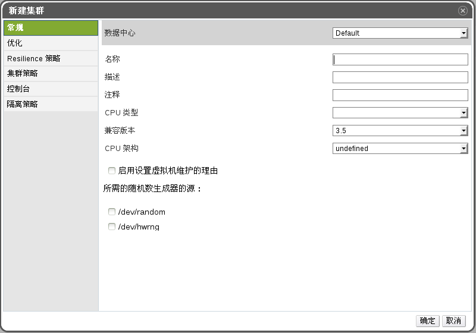
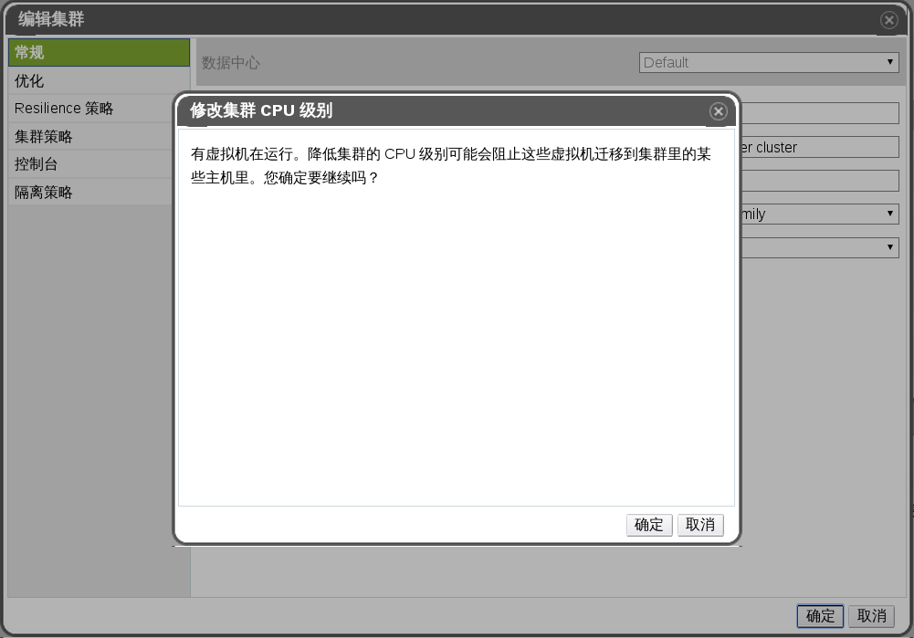

# 集群常规配置的解释

**新建集群**

下面的表格描述了**新建集群**或**编辑集群**窗口中**常规**标签下的设置。如果您设置的值中有不合法的，点击**确定**的时候，它们就会显示为橙色，并阻止您进行到下一步。每一项都会提示您期望值和有效值的范围。

**常规集群设置**

| 项 | 描述/操作 |
| -- | --------- |
| **数据中心** | 集群所在的数据中心。 |
| **名称** | 集群的名称。这个文本框最多可包含 40 个字符且要保证是独一无二的名称，可以是任意的大小写字母，数字，短横线和下划线的组合。 |
| **描述** | 集群的描述。我们建议您填写，但这并不是强制性的。 |
| **CPU 类型** | 集群的 CPU 类型，可从下列中选出（顺序：由高到低）：<ul><li>Intel Conroe Family</li><li>Intel Penryn Family</li><li>Intel Nehalem Family</li><li>Intel Westmere Family</li><li>Intel SandyBridge Family</li><li>Intel Haswell</li><li>AMD Opteron G1</li><li>AMD Opteron G2</li><li>AMD Opteron G3</li><li>AMD Opteron G4</li><li>AMD Opteron G5</li></ul>一个集群内的所有主机必须使用相同类型的 CPU (Intel 或 AMD); 一旦集群被成功创建后，其 CPU 类型将不允许变动。关于 CPU 的类型，请您尽可能选择低级别的主机的 CPU 类型。例如，一个 **Intel SandyBridge** 的主机可以附加到一个 **Intel Penryn** 的集群中的，相反，**Intel Conroe** 的主机则不可以附加到 **Inter Penryn** 中。如果集群中的主机的 CPU 类型不同，那么只有所有类型都具有的 CPU 指令集才可以被使用。 |
| **兼容版本** | EayunOS 企业级虚拟化的版本号，你可以从以下选择：<ul><li>4.0</li><li>4.1</li></ul>您不能选择比数据中心的版本更低的版本。 |
| **CPU 架构** | 如果您已经选择了 **CPU**类型，那么该选项会隐藏起来。 |
| **启用Virt服务** | 如果您选择了此单选框，在该集群下的主机会被用于运行虚拟机。 |
| **启用Gluster服务** | 如果您选择了此单选框，那么运行在该集群下的主机会作为 EayunOS 存储服务器节点，而不是用来运行虚拟机。且用户不能将 EayunOS 企业级虚拟化宿主机添加到该集群中。 |
| **启用设置虚拟机维护的理由** | 如果您选择了这个单选框，那么如果您想要对虚拟机进行 **关机** 或者 **断电** 操作的话，您必须写明您要这个做的原因，以便其它管理员可以理解您的行为。 |
| **启用设置主机维护的理由** | 如果您选择了这个单选框，那么如果您想要对主机进行 **关机** 或者 **断电** 操作的话，您必须写明您要这个做的原因，以便其它管理员可以理解您的行为。 |
| **所选随机数生成器的源** | 如果下面的一个（或者两个）复选框都被选择时，集群中所有的主机都必需包括这个设备，并使其可用。这可以把随机数生成器中的熵值传递到虚拟机中。<ul><li>**/dev/random source** - Linux 提供的随机数生成器。</li><li>**/dev/hwrng source** - 外部的硬件随机数生成器。请注意该特性只在运行了 CentOS 6.6 以及更高版本的和 CentOS 7 以及更高版本的主机上有效。 </li></ul>|

**修改集群 CPU 级别**
