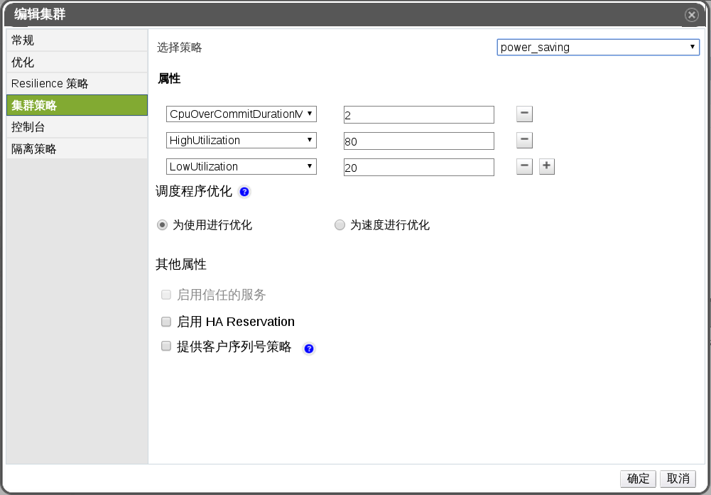
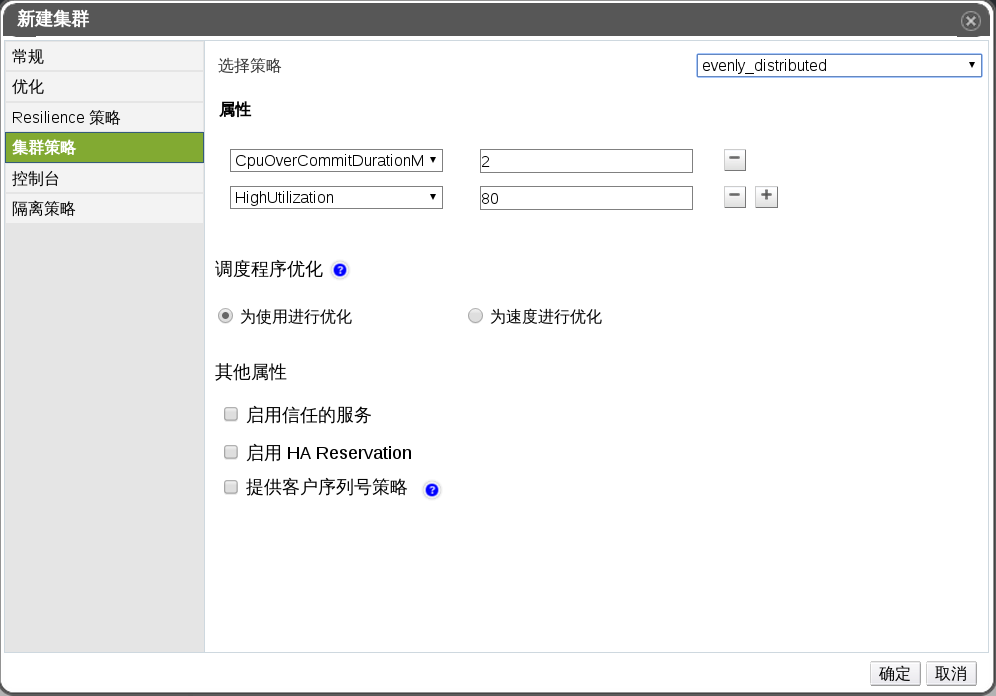
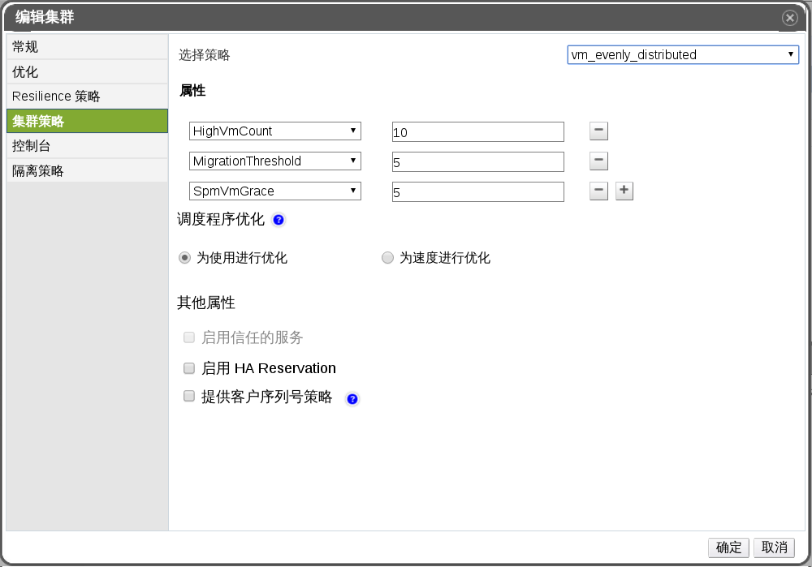

# 集群策略的解释

集群策略允许你指定使用并在可用主机间进行虚拟机的分配。定义集群策略可以在同一集群的主机间进行自动负载均衡。

**集群策略设置：power_saving**

**集群策略设置：evenly_distributed**

**集群策略设置：vm_evenly_distributed**

下面的表格描述了**编辑集群**窗口的设置。

**集群策略标签下的属性**

| **填充项/标签** | **描述/操作** |
| --------------- | ------------- |
| **None** | 将策略设置为 **None**，即表示不在主机间采用任何负载或电源共享。此为默认值。|
| **Evenly_distributed** | 在集群的所有主机中平均分配 CPU 处理负载。如果一台主机达到了定义的最大服务水平值，那么新加入到其上的虚拟机将无法开启。|
| **Power_saving** | 只在一部分主机中分配 CPU 的处理负载，以减少利用率较低的主机的能源消耗。如果主机的 CPU 负载长时间低于预设的下限值，且持续的时间超过了预选定义的时间，这时该主机上的虚拟机会被迁移到其它主机上，并在迁移后关闭这台主机。如果主机的负载达到预先定义的上限值，那么新加入到这台主机的虚拟机将不会被启动。|
| **vm_evenly_distributed** | 基于虚拟机的数量在主机间平均分配虚拟机。<ul><li>**HighVmCount**：设置每台主机上面最多能够运行的虚拟机数量。一旦这个值被超过，该主机就会被认为超出负载。</li><li>**MigrationThreshold**：定义了在主机上进行虚拟机迁移前的缓冲区。它是利用率最高的主机上运行的虚拟机的数量与利用率最低的主机上运行的虚拟机数量间的最大差值。当集群内所有的主机上运行的虚拟机数量处于这个缓冲区域内的时候，我们说该集群处于一个负载平衡的状态。</li><li>**SpmVmGrace**：定义了当主机为 SPM 时，计算集群策略时需要给该主机空余的虚拟机的个数，这样，SPM 主机将比其它主机有相对低的负载，所以，该值定义了在 SPM 主机上保留的可用虚拟机数。作为 SPM 的主机应该比其它主机有更低的负载，您可以通过定义这个变量的值来指定 SPM 主机应该比其它主机少运行多少个虚拟机。</li></ul>当集群中有任何一台运行了比 **HighVmCount** 数量还多的虚拟机的主机并且至少有一台主机，其运行的虚拟机数量不在 **MigrationThreshold** 缓冲区内时，我们认为该集群正处于一个负载不平衡的状态。|
| **CpuOverCommitDurationMinutes** | 在集群策略生效之前，一台主机可以在 CPU 负载超过已定义的利用率值的情况下运行的最长时间(以分钟为单位）。通过这个设置可以避免由于暂时的高 CPU 负载而激活集群策略而带来的不必要的虚拟机的迁移。最大值是 99。 |
| **HighUtilization** | 一个百分比值。如果一台主机的 CPU 使用率在定义好的时间内处于甚至高出了这个值，EayunOS 企业级虚拟化管理中心会将该主机上的虚拟机迁移到该集群的其它主机上，直到这个主机的 CPU 负载降低到 maximum service threshold 所设置的值以下。 |
| **LowUtilization** | 一个百分比值。如果一台主机的 CPU 使用率在已定义的时间范围内低于这个值，EayunOS 企业级虚拟化管理中心会将该主机上的虚拟机迁移到该集群的其它主机上，并关闭该台主机。当这个集群中有其它负载平衡需求或者集群中缺少足够的主机时，该台主机会被重新开启。 |
| **调度程序优化** | 优化主机权值和顺序的调度。<ul><li>**为使用进行优化**：在调度中包含权重模块以做出最好的选择。</li><li>**为速度进行优化**：一旦有超过 10 个请求没有被处理时，忽略主机权重。 </li></ul>|
| **启用信任的服务** | 开启和 OpenAttestation 服务的集成。在使用这个功能之前，请使用 **engine-config** 工具配置 OpenAttestation 服务器。 |
| **启用 HA Reservation** | EayunOS 虚拟化管理中心为高可用虚拟机开启监控集群能力的功能。管理中心要确保当那些可迁移的高可用虚拟机所在的主机发生了非预期问题的时候，集群可以提供足够的能力可以将那些高可用虚拟机迁移到其它主机上。 |

当一个主机的空闲内存低于 20% 时，“气球”命令（如 **mom.Controllers.Balloon - INFO Ballooning guest:half1 from 1096400 to 1991580**）会被记录在 **/var/log/vdsm/mom.log** 文件中。**/var/log/vdsm/mom.log** 是内存过度分配管理器（Memory Overcommit Manager）的日志文件。

