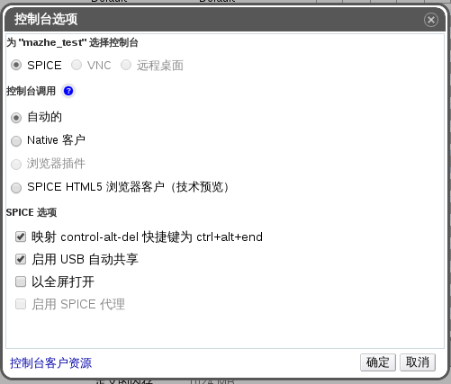

# SPICE 控制台选项

当选择了 SPICE 连接协议的时候，如下的选项可以在**控制台选项**窗口里设置。

**控制台选项窗口**

**控制台调用**

* **自动的**：虚拟化管理中心自动地选择连接类型。

* **Native 客户**：当你连接虚拟机的控制台时，将会下载一个文件，并通过 Remote Viewer 打开该文件来访问虚拟机。

* **浏览器插件**：当你连接虚拟机的控制台时，直接通过 Remote Viewer 打开可虚拟机的控制台。

* **SPICE HTML5 浏览器客户（技术预览）**：当你连接虚拟机的控制台时，浏览器多出一个选项卡并充当为虚拟机的控制台。

**SPICE 选项**

* **映射 control-alt-del 快捷键为 ctrl+alt+end**：勾选该设置来将 **Ctrl+Alt+Del** 键位组合映射到虚拟机内的 **Ctrl+Alt+End** 键位组合。

* **启用 USB 自动共享**：选择该选项来自动将客户机器的 USB 设备重定向到虚拟机里。如果该设置没有选择，客户机器的 USB 设备将继续链接到客户机器而不是虚拟机里。可以手动在 SPICE 客户端菜单里启用 USB 重定向。

* **以全屏打开**：选择该选项来将连接虚拟机的控制台自动全屏。按下 **SHIFT+F11** 来切换全屏模式。

* **启用 SPICE 代理**：选择该勾选框来启用 SPICE 代理。

> **重要**
>
> **浏览器插件**控制台选项只有在用 IE 访问管理门户或者用户门户时才能出现。该控制台选项使用的 **SpiceX.cab** 安装程序里提供的 Remote Viewer。对于所有其他的浏览器，**Native 客户**是默认的控制台选项，该控制台选项使用的 **virt-viewer-x86.msi** 和 **virt-viewer-x64.msi** 安装程序里提供的 Remote Viewer。
