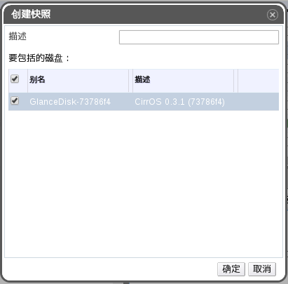

# 为虚拟机创建快照

**介绍** 
一个快照（snapshot）就是一个虚拟机的某些或所有磁盘在一个特定时间点上的操作系统和应用程序的记录。如果您所要进行的操作有可能会对系统产生非预期的结果，您可以在进行这个操作前对虚拟机进行一个快照。如果您所做的操作出现问题，您可以使用快照把系统恢复到以前的状态。

> **注意**
如果虚拟机所在的数据中心的兼容版本为 3.1 或更高时，您可以在虚拟机运行的时候对它进行快照。如果数据中心的兼容版本为 3.0 或更低版本时，您需要关闭虚拟机后才可以为它进行快照。

**创建一个虚拟机的快照**

1. 点**虚拟机**标签页并选择一个虚拟机。
2. 点**创建快照**打开**创建快照**窗口。

   

   **创建快照**

3. 输入这个快照的描述信息。
4. 选择**要包括的磁盘**。
5. 使用**保存内存**选项来指定您是否需要在快照中包括虚拟机的内存 。
6. 点**确定**创建快照并关闭窗口。

**结果** 
虚拟机上所选的磁盘上的操作系统和应用程序被保存在快照中，这个快照可以被预览，或用来恢复系统。快照的状态为 **Locked**，然后变为 **Ok**。当您点这个快照时，它的信息会在右面的详情框中的**常规**、**磁盘**、**网络接口**和**安装的应用程序**标签页中显示。
