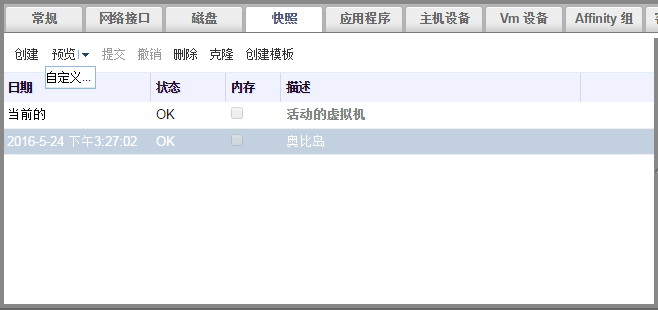

# 使用快照恢复虚拟机

**介绍** 
快照可以把虚拟机恢复到它以前的状态。

**使用快照来恢复一个虚拟机**

1. 选**虚拟机**标签页并选择一个虚拟机。
2. 在详情框中点**快照**标签页列出有效的快照。
3. 在左面的框中选择一个被用来恢复的快照，它的详细信息在右面的框中被显示。
4. 点**预览**旁的下箭头打开**自定义预览快照**窗口。

   

   **自定义预览快照**

5. 使用**虚拟机配置**、**内存**和**磁盘**选项来选择您需要恢复的项，然后点**确定**。这将允许您创建由多个快照中的配置和磁盘所组成的自定义快照，并使用自定义快照进行系统恢复。

   

   **自定义预览快照**

6. 启动虚拟机，它将会使用快照的磁盘映像来运行。
7. 点**提交**来使用快照恢复虚拟机。这个快照以后的所有快照都会被删除。

   或者，点**撤销**来终止恢复虚拟机的操作，虚拟机会返回到它当前的状态。

**结果** 
虚拟机被恢复到快照所在的时间点的状态，或返回到快照预览以前的状态。
