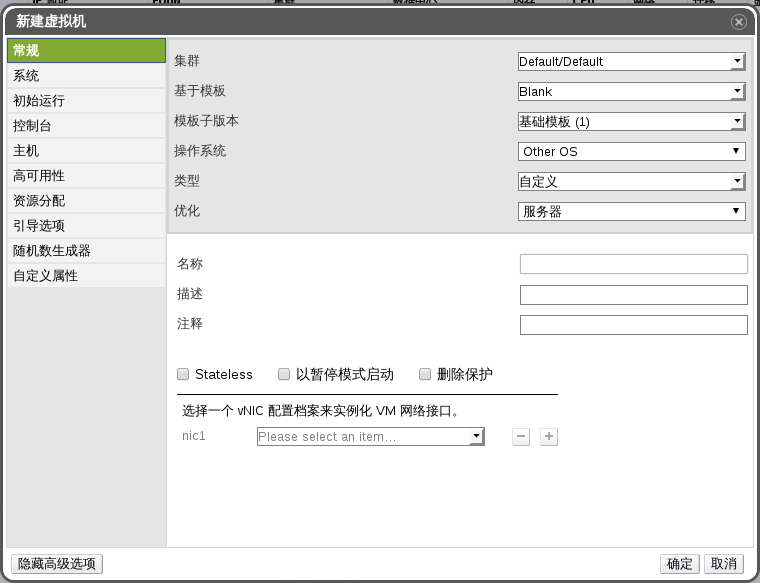

# 基于现成的模板创建虚拟机

**概述** 
你可以基于一个空的模板创建虚拟机，并且设置它的所有属性。

**创建一台虚拟机**

1. 点击虚拟机标签列出系统中的所有虚拟机。

2. 点击新建虚拟机按钮，打开新建虚拟机窗口。

 

 **新建虚拟机窗口**

3. 在**常规**选项卡中，填入**名称**和** 操作系统**信息，你可以默认不修改其他的属性。

4. 或者，在**第一次运行**，**控制台**，**主机**，**资源分配**，**启动选项**，**随机数生成器**，和**自定义属性**的选项卡中设置你的虚拟机参数。

5. 点击 **OK** 来创建虚拟机并且关闭窗口。

   然后**新建虚拟机*引导操作**弹出框弹出来了。

6. 使用引导操作按钮来完成虚拟机的配置或者选择**稍后配置**。

**结果**

虚拟机已经创建好了，在虚拟机列表下会显示出来，并且虚拟机的状态为
**Down**。在你使用该虚拟机之前，请给该虚拟机分配至少一个虚拟网卡和虚拟磁盘，并且安装一个操作系统。

