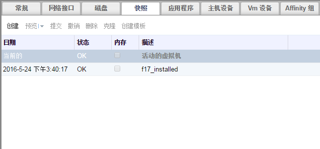

# 删除快照

**介绍** 
您可以删除一个快照，并把它从虚拟环境中永久删除

> **重要**
>
> 在删除快照的过程中，系统需要创建一个临时的逻辑卷来处理要删除的快照和其它快照间的数据整合。这个临时卷的大小需要和被删除的快照所基于的虚拟磁盘的大小相同。因此，在开始删除一个快照前，您需要确保您的系统中有足够的可用存储空间来创建这个临时逻辑卷。

**删除一个快照**

1. 选**虚拟机**标签页并选择一个虚拟机。
2. 在详情框中点**快照**页来列出有效的快照。

   

   **快照列表**

3. 选择要被删除的快照
4. 在导航框中，关闭和这个要被删除的快照相关联的虚拟机。
5. 点**删除**打开**删除快照**确认窗口。
6. 点**确定**删除快照并关闭窗口。

**结果**
您删除了一个虚拟机的快照。删除快照不会对虚拟机有任何影响。
