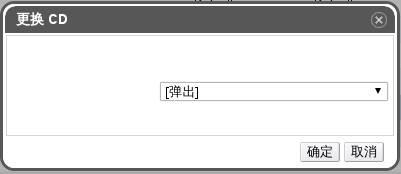

# 更改一个虚拟机的 CD 设备

**概述** 
你可以在虚拟机正在运行的时候改变虚拟机的 CD 设备。

> **注意**
>
> 你只能使用虚拟机所在集群能访问的 ISO 存储域里的 ISO 文件。这样，你需要先将 ISO 文件上传到对应的
> ISO 存储域中才能与虚拟机相关联。

**更改一个虚拟机的 CD 设备**

1. 在**虚拟机**选项卡中选择一台虚拟机。

2. 点击**更换 CD** 来打开**更换 CD** 弹出窗口。

   

   **更换 CD 弹出窗口**

3. 在下拉列表中：

   * 选择 **[Eject]** 来弹出当前附加到虚拟机的 CD。

     或者，

   * 选择下拉列表中的一个 CD 来弹出当前附加到虚拟机的 CD 并且附加该 CD 到虚拟机中。

4. 点击 **OK**。

**结果** 
你已经弹出当前附加到虚拟机的 CD，或者弹出当前附加到虚拟机的 CD 并且附加新的 CD 到虚拟机中了。
