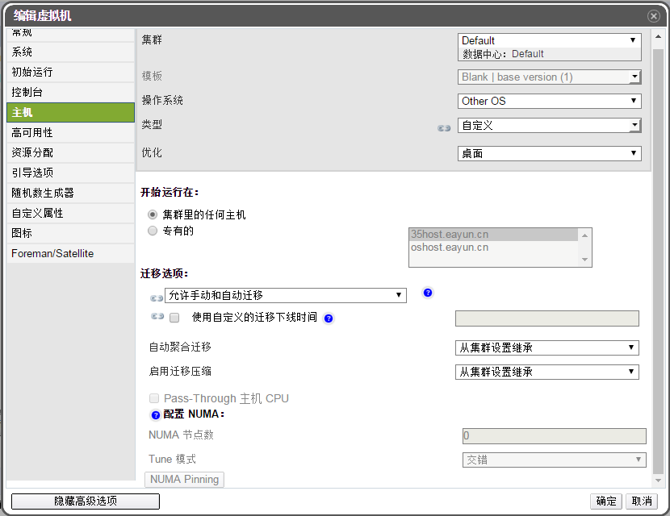

# 防止虚拟机自动迁移

**摘要** 
EayunOS 企业级虚拟化管理平台允许用户禁止虚拟机的自动迁移。甚至用户可以指定虚拟机不能手动
迁移，即虚拟机只能运行在特定的虚拟机上。

在虚拟机的高可用场景里，有时需要虚拟机只能运行在一台主机里，不能被各种
集群的策略迁移到其他主机。

**防止虚拟机自动迁移发生**

1. 点击**虚拟机**标签列出系统中的所有虚拟机，找到需要的虚拟机。
2. 点击**编辑**打开**编辑虚拟机**窗口。

   

   **编辑虚拟机窗口**

3. 点击**主机**标签。
4. 在**运行在**选项中指定虚拟机是运行在**集群里的任何主机**或**专有的**主机。如果选择了**专有的**，从下拉菜单中选择一个主机。

   > **警告**
   >
   > 目前，在 OVIRT 中，指定虚拟机运行在特定主机或者指定虚拟机不允
   > 许迁移和虚拟机高可用是冲突的。

5. 在**迁移选项**中，选择**不允许移植**, 此时可以勾选**使用主机 CPU** 来得到最佳的 CPU 性能。
6. 这个时候，可以在资源分配上设置 **CPU Pinning 拓扑结构**。
7. 点击**确定**完成设置。

**结果** 
虚拟机的迁移设置将会被改变。
