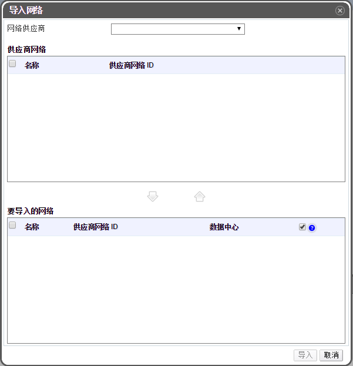

# 从外部供应商中导入网络

**概述**
如果提供网络服务的外部供应商已在 EayunOS 虚拟化管理中心中注册，该供应商提供的网络就能够被导入到 EayunOS 虚拟化管理中心中并被虚拟机使用。

**从外部供应商中导入一个网络**

1. 点击**网络**标签。

2. 点击**导入**按钮，弹出**导入网络**窗口。
 
**导入网络窗口**

3. 从**网络供应商**下拉列表中选择一个外部供应商。该网络供应商所提供的逻辑网络将会自动被找到并显示在**供应商网络**列表中。

4. 使用复选框，在**供应商网络**列表中选择需要导入的网络，然后点击向下箭头将那些网络移至**要导入的网络**列表中。

5. 在**数据中心** 

6. 

7. 点击*导入*按钮。

*结果*.
所选择的网络成功地被导入到MANAGER中并且能够正常使用。

> **Important**
>
> 外部供应商的发现及导入是一项技术预览特性。技术预览特性不被完全支持并且可能无法正常工作。但是，这类特性让用户能够提前接触到产品未来将要发生的技术变化，用户能够测试其功能并且在开发的过程中作出反馈。
