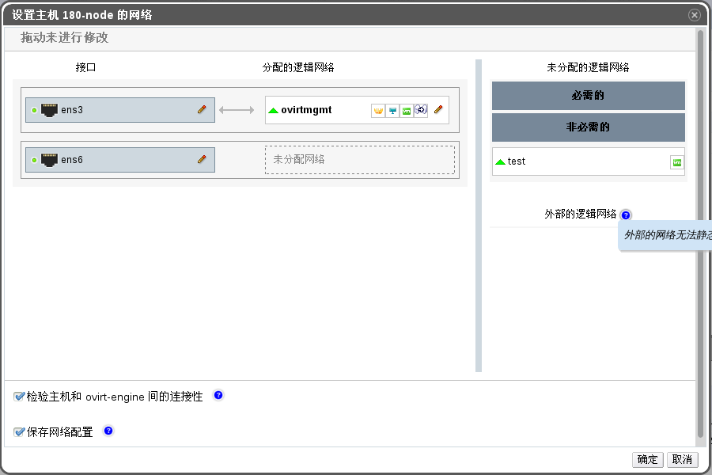

# 使用逻辑网络将多个 VLAN 添加到一块单独的网络接口上

**概述** 
可以为单独一块物理网卡添加多个 VLAN 从而可以分担主机上的网络流量。

> **重要**
>
> 您必须创建多个逻辑网络，并且这些逻辑网络必须是在**新建逻辑网络**或者**编辑逻辑网络**窗口中勾选了**启用 VLAN 标签**的网络。

**添加多个 VLAN 到使用逻辑网络的网络接口中**

1. 使用**主机**资源标签、树模型或者检索功能在结果列表中查找并选择一台位于您已为其分配启用 VLAN 标签的逻辑网络的集群下的主机。

2. 在详情面板中点击**网络接口**标签，列出该主机上的物理网卡。

3. 点击**设立主机网络**按钮，弹出**设立主机网络**窗口。

4. 将启用了 VLAN 标签的逻辑网络拖动到物理网卡旁边的**分配的逻辑网络**区域中。由于启用了 VLAN 标签，物理网卡能连接至多个已分配的逻辑网络上。

 
**设置主机网络**

5. 通过将您的鼠标停留在一个已分配的逻辑网络之上，点击铅笔小图标，会弹出**编辑管理网络**或者**编辑网络**窗口来编辑该逻辑网络的设置。

如果您的逻辑网络的定义与主机上的网络配置并未同步，请勾选上**同步网络**复选框。

从以下内容中选择**引导协议**：

-   **None**，

-   **DHCP**，或者

-   **Static**，
    并提供 **IP** 、**子网掩码**和**网关**。

点击**确定**按钮。

6. 勾选**检查主机和 EayunOS 虚拟化管理中心间的连接性**复选框来运行网络检查；只有该主机处于维护模式时有效。

7. 勾选**保存网络配置**选项。

8. 点击**确定**按钮。

通过对该集群中的每个主机的网络接口进行编辑来将该逻辑网络添加到每台主机上。这个完成后，该逻辑网络将会开始正常工作。

**结果** 
您成功地将多个启用了 VLAN 标签的逻辑网络添加到了一块单独的物理网卡上。可以多次重复该操作，每次在每台主机上选择并编辑同一块物理网卡，从而将启用不同 VLAN 标签的逻辑网络添加到一块单独的物理网卡上。
