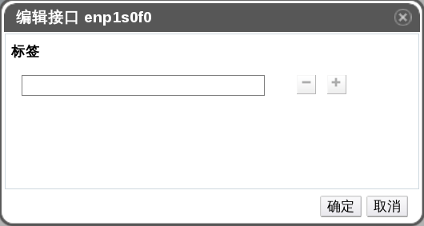

# 将网络标签添加到主机网卡中

**概述** 
使用网络标签在很大程度上简化了将逻辑网络分配给物理主机网卡的工作量。

**将网络标签添加到物理主机网卡中**
1. 使用**主机**资源标签，树模型，或者检索功能在结果列表中查找并选择一个已分配了启用 VLAN 标签的物理网卡的集群下主机。

2. 在详情面板中点击**网络接口**子标签会列出附加在该主机上的物理网卡。

3. 点击**设立主机网络**会弹出**设置主机网络**窗口

4. 将鼠标悬停在一个物理网卡上并点击铅笔图标，会弹出**编辑接口**。

 
**编辑接口窗口**

5. 在**标签**文本框中为网络标签输入一个名称，并使用 **+** 和 **-** 按钮来添加或删除额外的网络标签。

6. 点击**确定**。

**结果** 
您已经成功地将一个网络标签添加到一个物理主机网卡上了。任何新创建出来的并且具有相同网络标签的逻辑网络都会被自动分配到有相同网络标签的物理主机网卡上。并且，从逻辑网络中删除一个网络标签的时候，该逻辑网络会自动从所有具有相同网络标签的物理主机网卡上删除掉。

