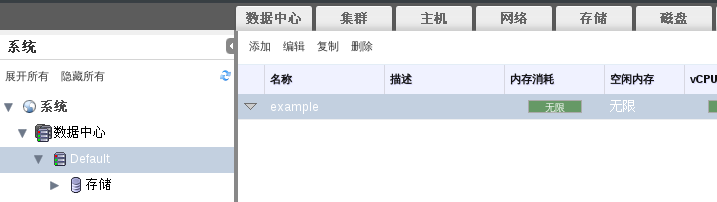
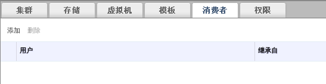

# 使用配额限制用户使用的资源

**概述** 
此过程展现如何使用配额来限制用户能够使用的资源。

**为一个用户设置一个配额**

1. 在树形面板中，选择您想要分配用户至其之上的配额所在的数据中心。

 

 **选择数据中心**

1. 在主面板中点击**配额**标签。

 

 **选择配额标签**

1. 在主面板的列表中选择目标配额。

 

 **选择目标配额**

1. 在详情面板中点击**消费者**子标签。

 

 **选择消费者子标签**

1. 点击位于详情面板中上方的**添加**按钮。

 

 **点击添加按钮**

1. 在弹出的**分配用户和组给配额**窗口中的**搜索**框中，输入您希望分配给该配额的用户名。

1. 点击**执行**。

1. 在结果列表中包含目标用户名的一行，勾选左边的选择框。

1. 在**分配用户和组给配额**窗口中点击**确定**按钮。

**结果** 
一段短暂的时间之后，该用户将会出现在详情面板中的*消费者*标签下。

