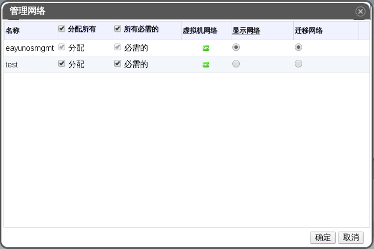

# 使用管理网络窗口为网络指定合适的类型

**摘要** 
为逻辑网络指定流量的类型以优化网络流量负载。

**为逻辑网络指定流量类型**

1. 使用**集群**资源列表，树形模型或搜索功能，在结果列表中查找并选择一个集群。

2. 在详情面板中选择**逻辑网络**标签，会列出已经分配给该集群的逻辑网络。

3. 点击**管理网络**，弹出**管理网络**窗口。
**管理网络**

4. 选择合适的复选框。

5. 点击**确定**保存变动并关闭窗口。

**结果**
您已经成功的通过为特定的逻辑网络分配了特定的流量类型，从而优化了网络流量。

> **注意**
>
> 由外部提供的网络将不能用于显示网络。

