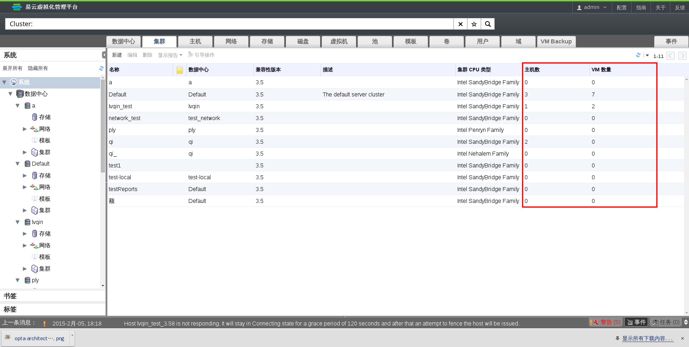

# 集群介绍

一个集群是一些主机组成的一个逻辑组，在同一集群下的主机可共享相同的存储域，且其 CPU 类型是必须相同的（Intel 或 AMD）。如果主机之间有不同代的 CPU，那么只能使用所有主机共有的 CPU 指令集。

系统中的每个集群必然属于一个数据中心，系统中的每台主机也必然属于一个集群，虚拟机会被动态地分配到集群内的任意一台主机中，且可以在主机间进行迁移，虚拟机是否要进行迁移要依据运行时**集群**选项卡和配置工具上定义的策略。集群是定义电源和负载共享策略的最高级别。

属于同一集群中的主机的数量和虚拟机的数量分别显示在了**主机数量**和**虚拟机数量**的结果列表中。

集群分为两种，一种是用于运行虚拟机的，另外一种是运行 EayunOS 存储服务器的, 一个集群不能同时即运行虚拟机服务, 又运行 EayunOS 存储服务器。

EayunOS 企业级虚拟化管理中心会在安装的时在 default 数据中心下默认创建一个叫 default 的集群。

**集群**
