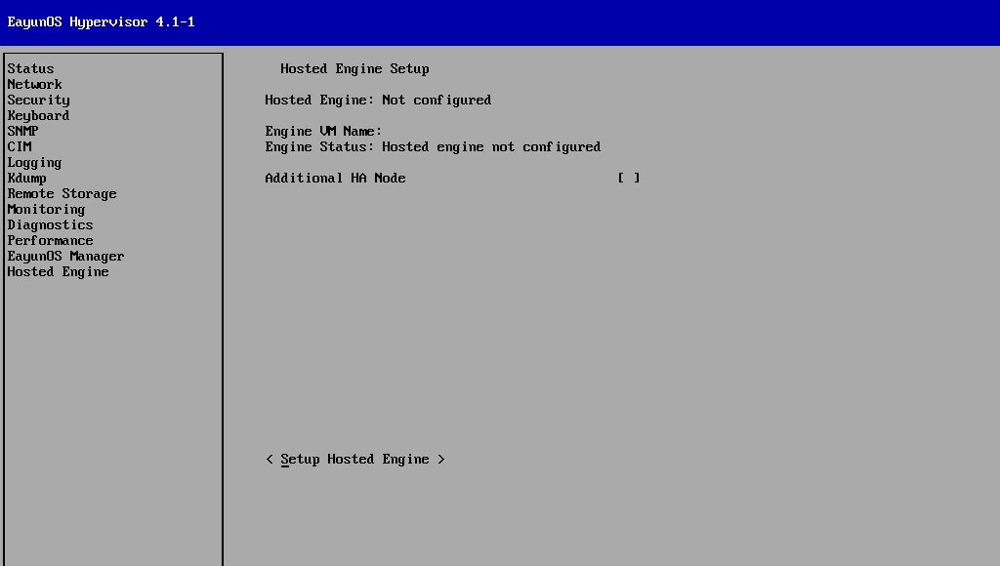

# Hosted Engine 的部署

1. 安装说明

   目前提供的是基于 EayunOS Appliance 的部署。

   * EayunOS Appliance 存放的目录为`/usr/share/EayunOS-Engine-Appliance/`
   * 不支持其他方式的部署

2. 部署前配置

   1. 以admin身份登录到 EayunOS 系统中
   2. 输入用户名 admin，按下【Enter】键。
   3. 输入 admin 用户的密码，该密码是在你安装 EayunOS 系统过程中所设置的密码，按下【Enter】键。

     （图 登录成功）

   4. 配置主机名（FQDN）
   5. 配置 EayunOS 系统的网络接口
   6. 配置 EayunOS 安全选项

3. 部署 Hosted Engine

   当 EayunOS 系统安装完成并进行了相应的配置后，就可以进行 Hosted Engine 的部署了。这个部署命令将进行一些交互，询问你一系列问题，并根据你的回答配置Hosted Engine的环境。当向它提供需要的数据后，它将启动一台虚拟机，作为 EayunOS 虚拟化管理中心的管理端。

   本章节提供一些主要步骤引导你完成 Hosted Engine 的部署。每个交互中包含几个需要用户输入的步骤。每一步都会在方括号中提供建议默认值。你可以按下【Enter】键同意使用这些默认值并进入下一个步骤，也可以选择填写括号中的其他值来进行配置。

   1. 选择左侧的 Hosted Engine，切换到 Hosted Engine 界面。

   

   2. 在 Engine ISO/OVA Location一栏填写 EayunOS  Appliance的存放路径：`/usr/share/ EayunOS -Engine-Appliance/ EayunOS -Engine-Appliance-4.1-Beta-1411260328.ova.gz`。（内容需要根据最终版本进行更改）
   3. 选择&lt; Setup Hosted Engine &gt;并按下【Enter】键，开始部署Hosted Engine。
   4. 提示`Begin Hosted Engine Setup`，选择&lt; Ok &gt;并按下【Enter】键，确定部署。
   5. 进入命令行的交互界面。

      1. 配置存储

         选择 Hosted Engine 虚拟机所使用的存储类型，默认存储类型是 nfs3。

         * 选择 nfs3，使用 NFS 存储

           填写 nfs3 或直接按下【Enter】键

           ```

               Please specify the storage you would like to use (iscsi, nfs3, nfs4)[nfs3]:

           ```

           输入 NFS 存储的路径，按下【Enter】键

           ```

               Please specify the full shared storage connection path to use (example: host:/path):storage-server:/path

           ```

         * 选择 iscsi，使用 iSCSI 存储

           填写 iscsi，按下【Enter】键

           ```

               Please specify the storage you would like to use (iscsi, nfs3, nfs4)[nfs3]:

           ```

      2. 安装检测

         hosted-engine 检测所选择的存储路径，如果未被使用，则作为第一台主机部署 Hosted Engine。

         ```

             [ INFO  ] Installing on first host
                       Please provide storage domain name. [hosted_storage]:
                       Local storage datacenter name is an internal name and currently will not be shown in engine's admin UI.Please enter local datacenter name [hosted_datacenter]: 

         ```

         运行 EayunOS 虚拟化管理中心的Hosted Engine虚拟机会被加入到一个名为hosted_datacenter（可自己定义名称）里，使用的存储为hosted_storage（可自己定义名称）。

         * 当检测到存储已经被使用，则作为Hosted Engine环境的HA主机而部署，询问用户时候作为additional host而加入到 EayunOS 虚拟化管理中心环境中。相关内容将在【部署HA主机】中进行解释和介绍。

      3. 配置网络

         系统会自动检测你所有的网络接口，在此网络接口上建立桥接。在建立桥接之前，系统将会询问你希望在那个网卡上建立桥接。

         ```

             Please indicate a nic to set ovirtmgmt bridge on: (eth0) [eth0]: 

         ```
         
         hosted-engine部署程序将会检查你的防火墙配置，帮你打开主机与虚拟化管理中心通信所需要的端口。如果不允许hosted-engine修改iptables的配置，那就必须手动打开 EayunOS  Hypervisor主机所需要的这些端口。

         ```

             iptables was detected on your computer, do you wish setup to configure it? (Yes, No)[Yes]: 

         ```

         需要提供一个正确的网关地址。

         ```
         
             Please indicate a pingable gateway IP address [192.168.0.1]: 

         ```

      4. 检查 EayunOS Appliance

         hosted-engine会检查 EayunOS  Appliance中的一些内容，确认一些需要的信息。在这一阶段不需要输入。

         ```

             [ INFO  ] Checking OVF archive content (could take a few minutes depending on archive size)
             [ INFO  ] Checking OVF XML content (could take a few minutes depending on archive size)

         ```

         检测到系统所支持的CPU类型，需要用户选择要使用的CPU类型。这里，我们使用默认的model_SandyBridge即可。

         ```

             The following CPU types are supported by this host:
                    - model_SandyBridge: Intel SandyBridge Family
                    - model_Westmere: Intel Westmere Family
                    - model_Nehalem: Intel Nehalem Family
                    - model_Penryn: Intel Penryn Family
                    - model_Conroe: Intel Conroe Family
             Please specify the CPU type to be used by the VM [model_SandyBridge]: 

         ```

         hosted-engine自动检测到系统的MAC地址，需要用户进行确认。

         ```

             You may specify a unicast MAC address for the VM or accept a randomly generated default [00:16:3e:10:f7:6f]: 

         ```

      5. 选择连接Hosted Engine虚拟机所使用的控制台类型

         支持的控制台类型有vnc和spice。默认选择的是vnc。

         ```

             Please specify the console type you would like to use to connect to the VM (vnc, spice) [vnc]: 

         ```

      6. 配置这台Hypervisor主机在 EayunOS 虚拟化管理中心中的主机名称

         当部署完成后，当前运行部署程序的主机会被加入到 EayunOS 虚拟化管理中心里。你需要配置这台主机的名称，默认名称是hosted_engine_1。

         ```

             Enter the name which will be used to identify this host inside the Administrator Portal [hosted_engine_1]: 

         ```

      7. 提供 EayunOS 虚拟化管理中心的管理门户密码

         当前进行部署的是Hosted Engine的第一台Hypervisor主机，即 EayunOS 虚拟化管理中心并不运行在这台Hypervisor主机上，而是运行在通过该hosted-engine程序创建的一台虚拟机上，我们已经使用 EayunOS  Appliance对其进行了封装。

         而在此设置 EayunOS 虚拟化管理中心的管理门户密码是为了告知这台主机你要设置的管理中心密码。当下一章节中 EayunOS 虚拟化管理中心的初始化完成后，将询问要将主机添加到哪个集群中（Default），此时hosted-engine程序会将这台主机加入到 EayunOS 虚拟化管理中心环境中。因此，密码必须设置正确，如果密码设置错误或不一致，会导致添加该主机失败。

         ```

             Enter 'admin@internal' user password that will be used for accessing the Administrator Portal: 
             Confirm 'admin@internal' user password: 

         ```

      8. 输入 EayunOS 虚拟化管理中心的域名全称（FQDN）

         在Hosted Engine架构中，部署完成时， EayunOS 虚拟化管理中心的HA主机会通过HA服务验证 EayunOS 管理端的运行状态。此时，HA服务需要知晓 EayunOS 虚拟化管理中心的FQDN，以进行验证。如果FQDN的配置不正确或没有配置，会导致验证失败，部署不能完整地完成。

         ```

             Please provide the FQDN for the engine you would like to use.
             This needs to match the FQDN that you will use for the engine installation within the VM.
             Note: This will be the FQDN of the VM you are now going to create,
             it should not point to the base host or to any other existing machine.
             Engine FQDN: 

         ```
      9. 配置报告服务（SMTP）

         需要配置报告服务的主机名、TCP端口、email地址和接收email的地址。

         ```

             Please provide the name of the SMTP server through which we will send notifications [localhost]: 
             Please provide the TCP port number of the SMTP server [25]: 
             Please provide the email address from which notifications will be sent [root@localhost]: 
             Please provide a comma-separated list of email addresses which will get notifications [root@localhost]: 

         ```

      10. 配置完成，对配置进行预览和确认

         hosted-engine会验证你的所有答案，并警告你可能发生的问题。

         ```

             [ INFO  ] Stage: Setup validation
             [WARNING] Cannot validate host name settings, reason: resolved host does not match any of the local addresses

         ```

         在预览阶段，hosted-engine会给你展示你所输入的配置，并提供修改的机会。如果你选择运行，即直接按下【Enter】键（默认为【Yes】），hosted-engine会进行安装并创建 EayunOS 虚拟化管理中心的虚拟机。

         ```

             --== CONFIGURATION PREVIEW ==--
            
             Bridge interface                   : eth0
             Engine FQDN                        : engine.testing1
             Bridge name                        : ovirtmgmt
             SSH daemon port                    : 22
             Firewall manager                   : iptables
             Gateway address                    : 192.168.0.1
             Host name for web application      : hosted_engine_1
             Host ID                            : 1
             Image alias                        : hosted_engine
             Image size GB                      : 8
             Storage connection                 : 192.168.3.85:/home/test/test
             Console type                       : vnc
             Memory size MB                     : 4096
             MAC address                        : 00:16:3e:10:f7:6f
             Boot type                          : disk
             Number of CPUs                     : 4
             OVF archive (for disk boot)        : /usr/share/ EayunOS -Engine-Appliance/ EayunOS -Engine-Appliance-4.1-Beta-1411260328.ova.gz
             CPU Type                           : model_SandyBridge
            
             Please confirm installation settings (Yes, No)[Yes]: 

         ```

      11. 创建运行 EayunOS 虚拟化管理中心的虚拟机

         hosted-engine会对配置和 EayunOS  Appliance进行处理，使用Appliance创建一台虚拟机。这台虚拟机已经安装部署好 EayunOS 虚拟化管理中心，但你需要对它进行一些配置。

         你需要通过控制台打开这台虚拟机，进行 EayunOS 虚拟化管理中心的配置。详细过程请看【engine-console的使用】。

         ```

             [ INFO  ] Creating VM
                       You can now connect to the VM with the following command:
                           /bin/remote-viewer vnc://localhost:5900
                       Use temporary password "[password]" to connect to vnc console.
                       Please note that in order to use remote-viewer you need to be able to run graphical applications.
                       This means that if you are using ssh you have to supply the -Y flag (enables trusted X11 forwarding).
                       Otherwise you can run the command from a terminal in your preferred desktop environment.
                       If you cannot run graphical applications you can connect to the graphic console from another host or connect to the console using the following command:
                       virsh -c qemu+tls://Test/system console HostedEngine

         ```

         此时，hosted-engine会等待你对 EayunOS 虚拟化管理中心配置完成。配置完成后，输入【1】，按下【Enter】键，即可继续进行下一步操作。

         在这里，我们先转入下一章节，对 EayunOS 虚拟化管理中心进行配置，配置完成后再回到hosted-engine的部署程序中继续未完成的操作。请看【engine-console的使用】。

         ```

             If you need to reboot the VM you will need to start it manually using the command:
             hosted-engine --vm-start
             You can then set a temporary password using the command:
             hosted-engine --add-console-password
             Please install and setup the engine in the VM.
             You may also be interested in installing ovirt-guest-agent-common package in the VM.
             To continue make a selection from the options below:
             (1) Continue setup - engine installation is complete
             (2) Power off and restart the VM
             (3) Abort setup
            
             (1, 2, 3)[1]:

         ```
