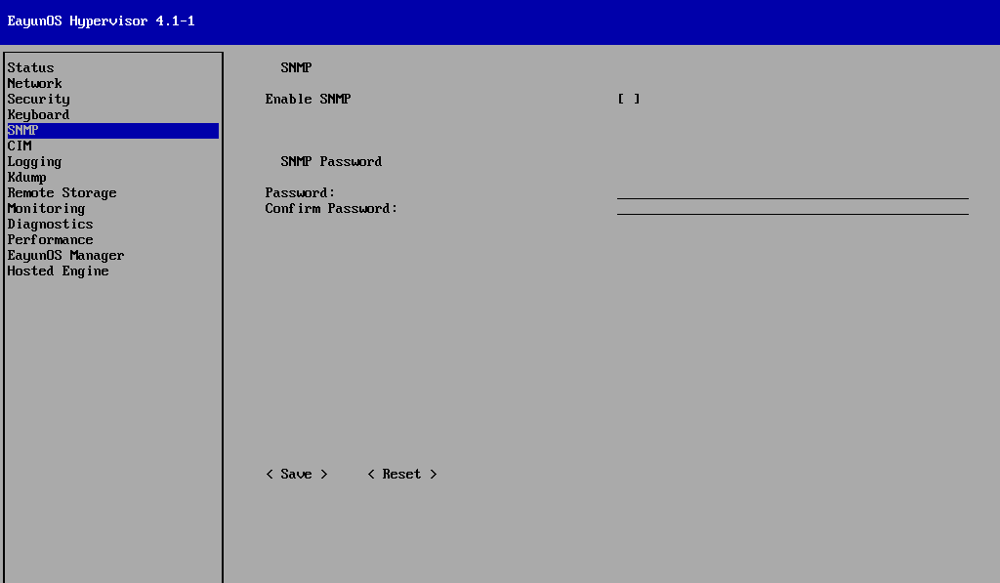

# 配置 Hypervisor 简单网络管理协议（SNMP）

**摘要**

* 选择左侧的 SNMP，切换到 SNMP 界面。 
* SNMP 界面允许你启用和配置 SNMP 的密码。

  

1. 选择`Enable SNMP`栏。
2. 按下【Enter】键或空格键，选择启用SNMP或禁用SNMP。默认SNMP是禁用的。
3. 在`SNMP Password`的Password栏，输入SNMP的密码。
4. 在`SNMP Password`的Confirm Password栏，输入确认密码，保证两次输入密码内容一致。
5. 选择&lt; Save &gt;并按下【Enter】键，保存SNMP配置。

**结果**

SNMP 配置完成。

