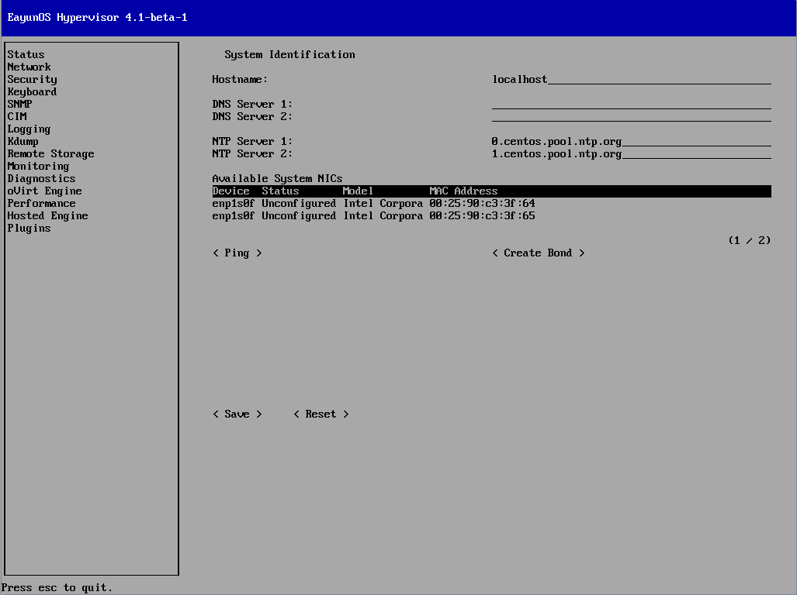
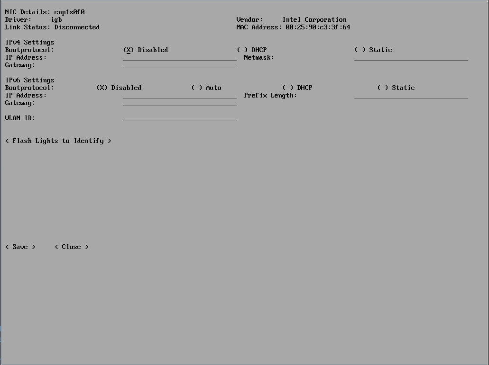

# 配置 Hypervisor 网络

1. Hypervisor 网络配置界面介绍

   选择左侧的Network项，可以配置 Hypervisor 的网络等信息。

   * 该界面用来配置：

      * Hostname :  Hypervisor 的主机名。
      * DNS Server : 使用的DNS服务器地址。
      * NTP Server : 使用的NTP服务器地址。
      * Available System NICs : 使用的网络接口。

   * 该网络配置界面也提供了一系列按钮来测试和配置网络接口：

      * < Ping > : 进入界面后允许你ping一个由你指定的IP地址，并且设置ping的次数。
      * < Create Bond > : Create Bond允许你创建网卡之间的绑定。

   

2. 配置 Hypervisor 主机名

**摘要**

Hypervisor 的主机名是可以配置的。

   1. 在 Network 界面下，选择 Hostname 一栏，输入主机名。
   2. 选择< Save >并按下【Enter】键，保存主机名配置。
   3. 配置成功后有相关提示，选择< Close >并按下【Enter】键，回到配置界面。

**结果**

主机名配置成功。

3. 为 Hypervisor 配置域名服务器

**摘要**

Hypervisor 支持指定一个或者多个域名服务器，在转换主机名和域名的时候会用到这些服务器。

   1. 设置或者改变主DNS服务器，选择DNS Server1那一栏，并且键入新的主DNS服务器的IP地址。
   1. 设置或者改变备选的DNS服务器，选择DNS Server2那一栏，并且键入行的备用DNS服务器的IP地址。
   1. 选择< Save >并且按下【Enter】键来改变对DNS的配置。

**结果**

主 DNS 服务器和备选 DNS 服务器被改变了。

4. 为 Hypervisor 配置网络时间协议（NTP）

**摘要**

Hypervisor 支持指定一个或者多个网络时间协议服务器，以此来保证虚拟机监视器和NTP服务器的系统时钟同步。保证虚拟机监视器和RHEVM的时间资源同步是非常重要的。这可以确保在RHEV环境中的准确时间。时间的同步影响了VM之间的迁移。

   1. 设置或者改变主NTP服务器，选择NTP Server1那一栏，并且键入新的主NTP服务器的IP地址或者主机名。
   1. 设置或者改变备选的NTP服务器，选择NTP Server2那一栏，并且键入行的备用NTP服务器的IP地址或者主机名。
   1. 选择< Save >并且按【Enter】键来改变对NTP的配置。

**结果**

主 NTP 服务器和备选 NTP 服务器被改变了。

5. 配置 Hypervisor 的网络接口

**摘要**

每个 Hypervisor 检测到的网络接口都会显示下面内容：

   * 设备
   * 状态
   * 模式
   * MAC 地址

   若要让 Hypervisor 连接到EayunOS管理端，至少有一个网络接口要配置好。

   1. 设备鉴别

      在 Available System NICs 处选择一块网卡，并按下【Enter】键，进入网络配置页面。

      

      当列表中的每一项所指向的物理设备不明确的时候， Hypervisor 可以通过闪物理设备的信号灯来帮助鉴别。为了使用这个工具，选择列表中的一项后，选择< Flash Lights to Identify >键，并按下【Enter】。然后注意哪个物理设备的信号灯开始闪。所选设备的配置界面就会显示出来。

   2. IPv4 配置

      Hypervisor 支持DHCP和静态网络配置（static）。

      * 动态网络配置（DHCP）

        动态网络配置允许 Hypervisor 通过DHCP来动态的被分配地址。在IPv4 Settings中选择DHCP选项，并按空格来打开动态IPv4网络配置功能。

      * 静态网络配置

        静态网络配置允许 Hypervisor 手动分配IP地址。在IPv4 Settings中选择Static选项，并按空格来打开静态IPv4网络配置功能。

        选择static选项会出现IP Address，Netmask，Gateway栏。IP Address，Netmask，Gateway栏必须填写，来完成静态网络的配置。

        **详细说明必须满足的内容：**

          * IP Address : 在该网络中不能已经被使用。
          * Netmask : 需要和网络中其他主机使用的netmask匹配。
          * Gateway : 需要和网络中的其他机器使用的gateway匹配。

        如果你不清楚要使用的IP Address，Netmask或者Gateway，请联系网络管理员或者考虑动态配置。

        > **示例：Static IPv4网络配置**
        >
        > IPv4 Settings
        >
        > ( ) Disabled  ( ) DHCP  (\*) Static
        >
        > IP Address: 192.168.122.100_    Netmask: 255.255.255.0_    Gateway: 192.168.1.1_

   3. IPv6 设置

      暂不支持IPv6网络，IPv6网络选项必须保持Disabled。

   4. VLAN 配置

      如果需要VLAN的话，在VLAN ID一栏为所选的设备填上VLAN的标识符。

   5. 保存网络配置

      当完成了为所选设备配置好所有的网络选项时，必须对配置进行保存。

      1. 选择< Save >并按下【Enter】键保存网络配置。
      2. 配置成功后有相关提示，选择< Close >并按下【Enter】键，回到配置界面。

**结果**

等待大约 30 秒，网络配置成功，提示`All changes were applied successfully`，能够使用网络。
