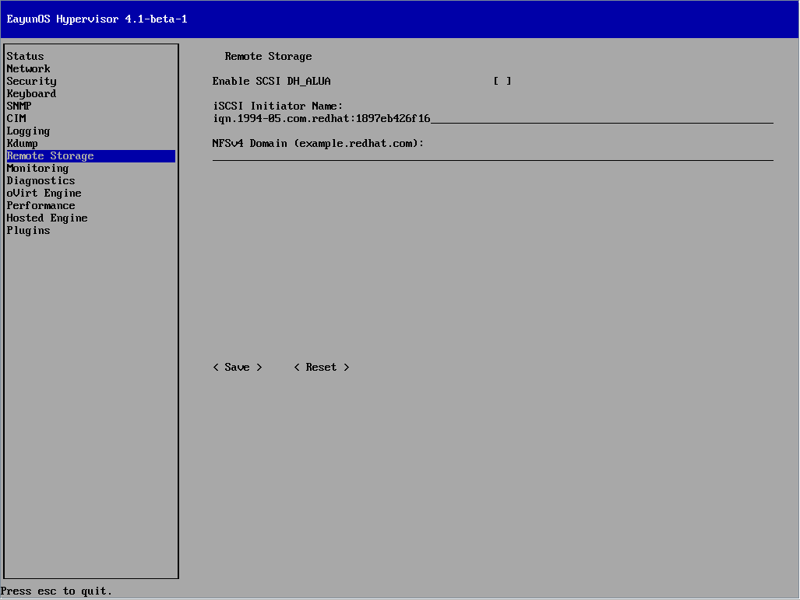

# 配置Hypervisor远程存储

**摘要**

* 选择左侧的Remote Storage，切换到远程存储界面。
* 支持使用iSCSI initiator来进行远程存储。在Remote Storage界面完成对iSCSI initiator的配置。

1. 在iSCSI Initiator名称栏输入initiator名称。

   > **示例：iSCSI Initiator名称**
   >
   > iSCSI Initiator Name:
   >
   > iqn.2012-06.eayun.com:target1

2. 选择&lt; Save &gt;并按下【Enter】键，保存远程存储的配置。

**结果**

远程存储配置成功，配置被更新。
