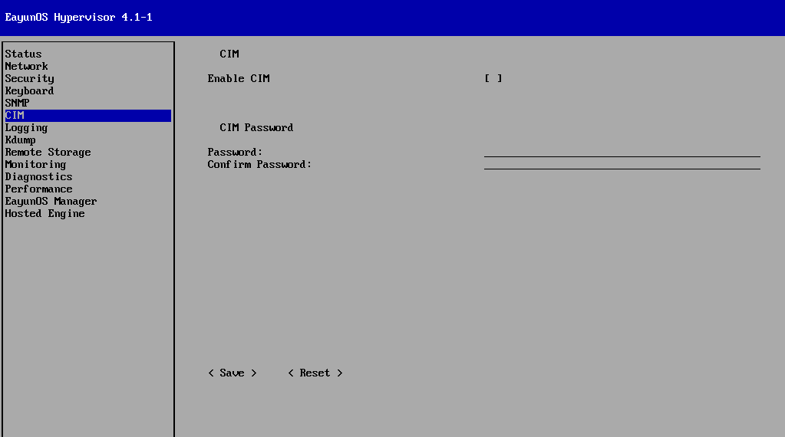

# 配置 Hypervisor 通用信息模型

**摘要**

* 选择左侧的 CIM，切换到 CIM 界面。
* 启用和配置通用信息模型（CIM）允许你将Hypervisor连接到现有的CIM管理框架中，并监视Hypervisor上虚拟机的运行。

  

1. 选择`Enable CIM`栏。
2. 按下【Enter】键或空格键，选择启用 CIM 或禁用 CIM。默认 CIM 是禁用的。
3. 在 Password 栏输入密码。你将使用这个密码来用 CIM 访问 Hypervisor。
4. 在 Confirm Password 栏重新输入一次密码，保证两次输入密码的内容一致。
5. 选择&lt; Save &gt;并按下【Enter】键，保存CIM配置。

**结果**

经过设置，Hypervisor 可以接受来自 CIM 使用密码的连接认证。但你要添加你的 Hypervisor 到你的通用信息模型管理器（CIMOM）。
