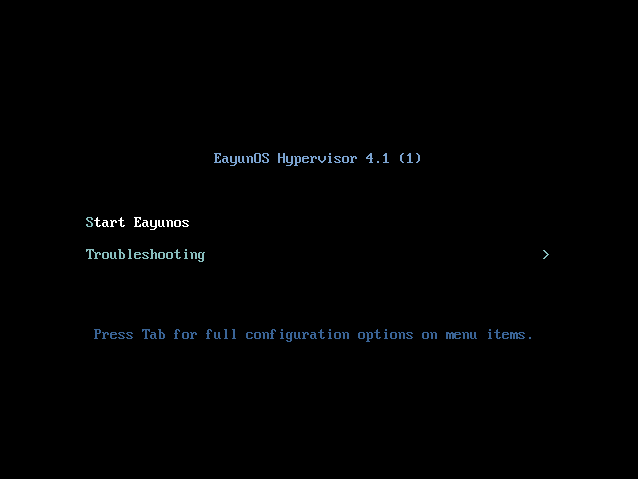
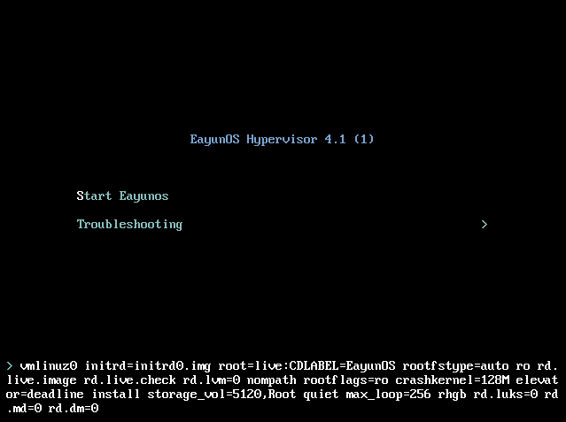

# 启动安装

1. 插入 EayunOS 安装盘

2. 启动系统，并确定系统从安装光盘启动。

3. 出现开机画面。如果不提供输入，EayunOS 安装程序会在30秒后，使用默认的内核参数启动。

   

4. 如果需要选择其他菜单，按下【Down】键，选择【Troubleshooting】，按下【Enter】键，进入菜单选项。

5. 选择【Start EayunOS 】，按下【Enter】，以默认的内核参数启动 EayunOS 。

   或者按下【Tab】键来编辑内核参数。在编辑模式，你可以添加或删除内核参数。内核参数必须用空格分离。设置好需要的内核参数后，直接按下【Enter】键，保存设置并启动系统。如要放弃修改，也可以按下【Esc】键放弃对内核参数所做的任何修改。

   

   此时，EayunOS 在设置的启动模式下启动了。
