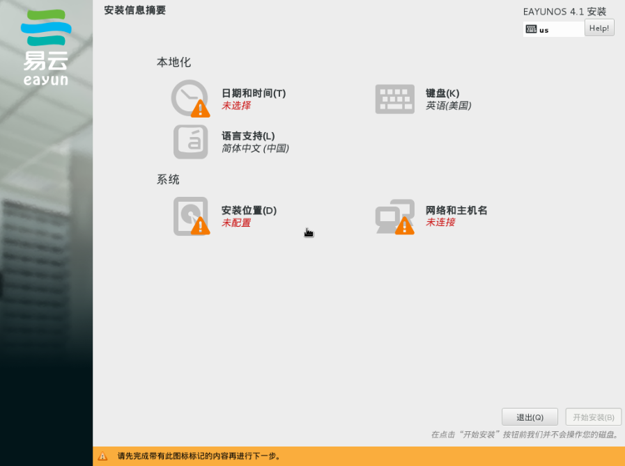
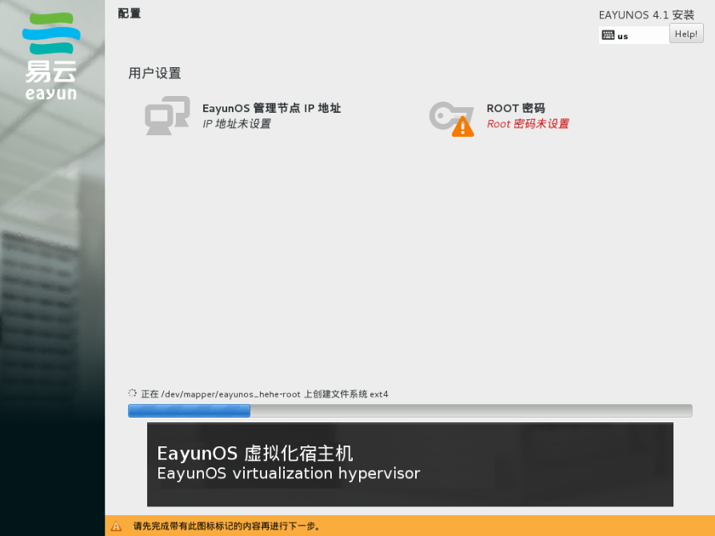

# 开始安装

1. 在安装之前，你需要确定好哪些裸机用于管理平台，哪些裸机用于宿主机。
2. 让裸机从 EayunOS 精简版的 DVD 启动。
3. 进入如下界面，并选择该裸机是作为管理平台（Management Node）安装，还是作为宿主机（Compute Node）安装，然后按下回车键。

   

4. 进入如下图的配置界面，并配置好下图中标记有红色叹号图标的项目。

   

5. 点击右下角的**开始安装(B)**按钮。
6. 进入如下图的安装进度界面，并配置好 root 用户的密码。如果在第三步中选择了宿主机安装，那么在该界面中还可配置管理平台的 IP 地址，用于安装完成时自动将本宿主机注册到管理平台。

   

7. 等待安装完成，然后重启机器，从硬盘启动。

   * 若在第 3 步选择的是管理平台安装，等待一段时间（10～20 分钟），从浏览器访问管理平台机器的 IP 地址，并参考 [EayunOS 管理员手册](http://docs.eayun.cn/zh-CN/EayunOS/4.1/html/administration-guide/index.html)进行进一步的配置。
   * 若在第 3 步选择的是宿主机安装，且在第 6 步中配置了管理平台的 IP 地址的话，等待一段时间（5～20 分钟），管理平台中会出现该台新安装的宿主机。
   * 若在第 3 步选择的是宿主机安装，且在第 6 步中没有配置管理平台的 IP 地址的话，等待一段时间（5～20 分钟），在管理平台的**主机**标签下手动添加该台宿主机即可。
