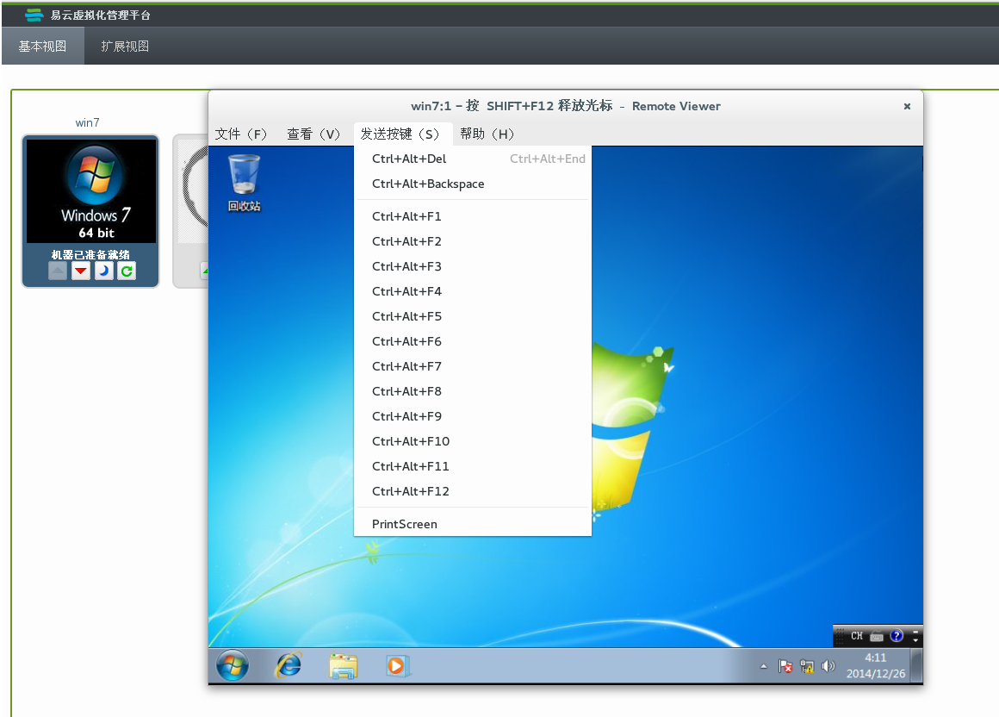

# 使用SPICE属性配置

当Windows用户连接虚拟机时，Remote
Viewer提供了大量的SPICE属性发送键盘输入指令和命令给虚拟机。如图：

|选项|快捷键|
|----|------|
|*File*|-   Screenshot: 对活动窗口进行截图并保存到本地指定的位置。  -   USB device     selection:若您的虚拟机已经启用USB重定向，插在您物理客户机上的USB可以在USB     device selection菜单项内访问到。  -   Quit：关闭控制台可以使用快捷键Shift+Ctrl+Q。  |
|*View*|-   Full screen:     切换全屏模式打开或关闭。当启用全屏模式，全屏模式扩展虚拟机窗口填充整个电脑屏幕。当禁用全屏模式，一个窗口显示虚拟机。启用或禁用全屏模式使用快捷键SHIFT     +F11.  -   Zoom : 放大或缩小控制台窗口。Ctrl++放大窗口, Ctrl+- 缩小窗口，     Ctrl+0 还原窗口到原始大小。  -   Autom atically resize:     勾选启用此选项，即可根据控制台窗口尺寸自动调整虚拟机大小 。  -   Displays: 允许用户可以“启用”和“禁用”对虚拟机的显示。  |
|*Send key*|-   Ctrl+Alt+Del:     按Ctrl+Alt+Del键在Linux虚拟机重启虚拟机；在Windows虚拟机显示任务管理器或Windows安全对话框。  -   Ctrl+Alt+Backspace: 重启虚拟机控制台恢复对虚拟机的控制  -   Ctrl+Alt+F1  -   Ctrl+Alt+F2  -   Ctrl+Alt+F3  -   Ctrl+Alt+F4  -   Ctrl+Alt+F5  -   Ctrl+Alt+F6  -   Ctrl+Alt+F7  -   Ctrl+Alt+F8  -   Ctrl+Alt+F9  -   Ctrl+Alt+F10  |

