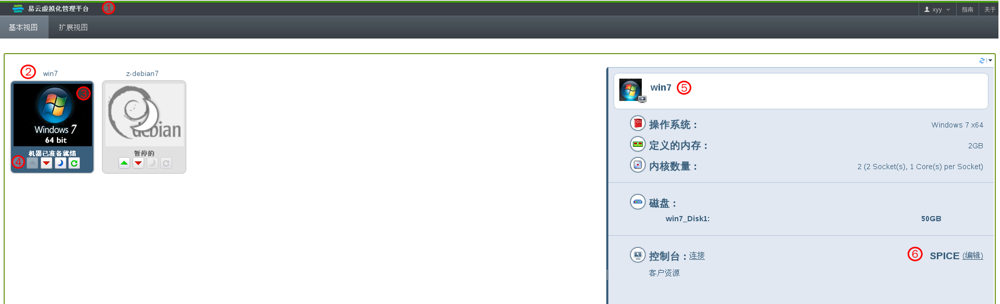

# 用户门户界面

在用户门户图形界面，您能够看到和使用所有属于您的虚拟机。该界面主要由三个区域组成：标题栏、虚拟机区域和一个详细的面板。一些您使用虚拟机用到的控制按钮。如图：

标题栏（1），包含登录该系统的用户名和注销按钮。

在虚拟机区域，显示分配给您的虚拟机及虚拟机桌面池（2）。显示虚拟机的操作系统的logo（3）。当虚拟机开启时，您双击该虚拟机的logo可以连接虚拟机。

每个虚拟机开始、停止及暂停虚拟机的按钮的图标类似一个媒体播放按钮（4）

1.  绿色播放按钮用于启动虚拟机：当虚拟机暂停、停止或关闭状态时显示绿色播放按钮。

2.  红色停止按钮用于停止虚拟机：当虚拟机正在运行时显示红色停止按钮。

3.  橙色暂停按钮用于暂时停止虚拟机：为了重新启动它，按绿色播放按钮。

虚拟机的状态由虚拟机图标上的文本（虚拟机准备就绪活虚拟机关闭）表示。

点击一个虚拟机，在右侧显示选择的虚拟机的详细面板（5），包括操作系统、定义的内存、CPU核数和虚拟机磁盘大小。您也能配置连接协议（6）可以使用USB设备或是本地驱动等。

