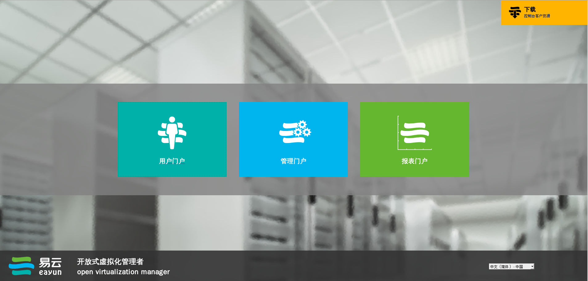
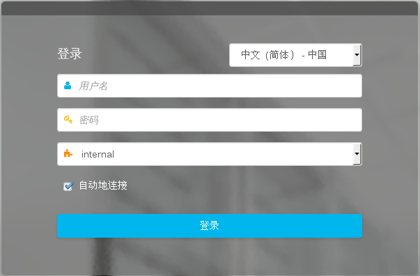
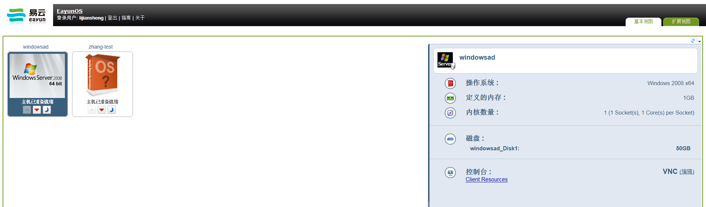

# 登录用户门户

直接通过您的浏览器登录EayunOS虚拟化用户门户。

在浏览器地址栏内输入User Portal URL。地址格式如：https://server.exam
ple.com /UserPortal。显示登录页面。

或者，在地址栏内输入server地址，访问欢迎页面。点击【用户门户】。如图：

输入用户名和密码，在域下拉菜单内选择正确的域。如图：

1.  如果您只有一个正在运行使用的虚拟机，勾选中“自动地连接”，直接连接到您的虚拟机。

2.  如果您有多个运行使用的虚拟机或者不想自动连接到一个虚拟机，不勾选“自动地连接”。

3.  在登录窗口的右下角下拉菜单内选择要使用的语言。

点击【登录】，显示分配给您的虚拟机列表页面。如图

