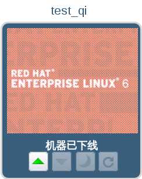
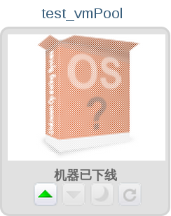
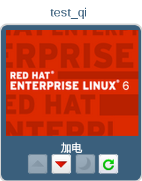
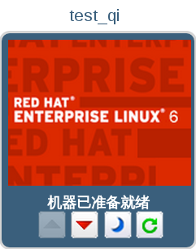

# 启动一台虚拟机

想要在用户门户中访问虚拟机，您首先需要启动它，然后才能与它进行连接。如果一台虚拟机处于关闭状态，虚拟机的图标会被“灰掉”，并显示**机器已下线**。

您可以被分配一台独立的虚拟机，也可以从虚拟机池中被分配一台或多台虚拟机。在同一个虚拟机池中的虚拟机都基于基本模板克隆产生，它们有相同的操作系统和应用程序。

> **注意**
>
> 如果您是从虚拟机池中来获取一台虚拟机的，系统不能保证每次都分配给您相同的虚拟机。但是，如果您为从虚拟机池中获得的一台虚拟机配置了控制台选项，这些选项会被保存，并会作为该虚拟机池中所获得的虚拟机的默认配置。

**启动一台虚拟机**

1. 按照下列步骤执行启动一台独立的虚拟机，或从虚拟机池中获得一台虚拟机：
   * 要启动一台独立的虚拟机，请您选择相应的虚拟机图标，并点击  按钮。 
    
   **启动虚拟机**

   * 要想从虚拟机池中获取一台虚拟机，请您选择相应的虚拟机图标，并点击  按钮。 
    
   **从虚拟机池中获取一台虚拟机**  
   如果虚拟机池中有一台可用的虚拟机，那么该台可用的虚拟机的图标会出现在您的虚拟机列表中。以下的步骤将适用于这个虚拟   机。如果您可以从虚拟机池中获得多个虚拟机，这个虚拟机池的图标会变为您从虚拟机池中获得的最后一台虚拟机的图标。

2. 虚拟机的启动
   
    
   **启动中的虚拟机**

3. 当虚拟机启动后，它的图标将不再是灰色的(禁用的)，图标下的文字提示我们它的状态变为了**机器已准备就绪**。您现在便可以连接到这台虚拟机了。

     
   **启动后的虚拟机**

> **备注** 
> 您只能在虚拟机启动后才可以与它进行连接。
