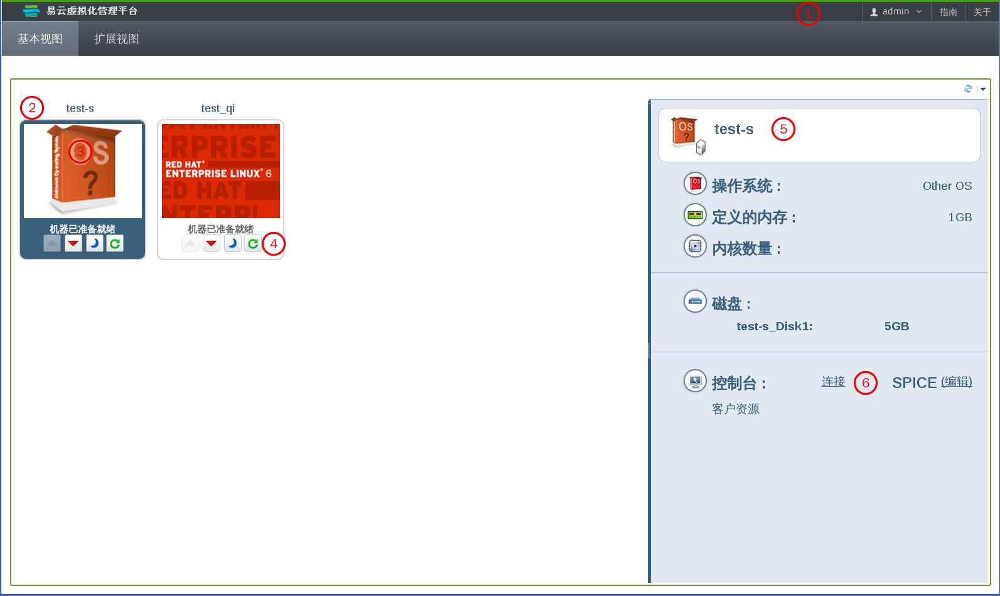

# 基本视图界面

您可以通过基本视图标签页来查看并使用所有分配给您的虚拟机。这个界面包括了三个部分：标题条、虚拟机区域和详情框。您可以使用一组控制按钮来操作虚拟机。

**基本视图界面**

标题条（1）包括了登录到用户门户的**用户**的名称，以及到**指南**页和**关于**页的链接。
在虚拟机区域中会显示分配给您的虚拟机或虚拟机池的名称（2）。
虚拟机操作系统的 logo 图标也会被显示（3）。
当虚拟机正在运行时，您可以双击它的图标来连接到那个虚拟机。您可以使用每个虚拟机图标中的“运行”、“停止”或“暂停”键来对虚拟机进行相关的操作（4）。
*  绿色的运行按钮会启动虚拟机，您可以在虚拟机处于暂停、停止或关机的状态时使用它。
*  红色的停止按钮会停止虚拟机的运行，您可以在虚拟机处于运行的状态时使用它。
*  蓝色的暂停按钮会暂停虚拟机的运行。要重新运行它，请点绿色的运行按钮。
*  绿色的重新启动按钮会重启虚拟机。您可以在虚拟机处于运行的状态时使用它。

虚拟机图标下面会显示虚拟机当前的状态 - **机器已准备就绪**或**机器已下线**。
点一个虚拟机会在右面的详情框中显示它的详细信息（5），如操作系统、定义的内存、内核数量、虚拟磁盘大小。
您也可以配置连接协议选项（6），如开启 USB 驱动或者本地磁盘。

