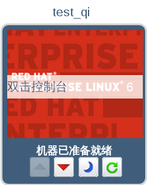

# 连接至一台已经启动的虚拟机

虚拟机启动后，您就可以像操作一台物理机一样来操作虚拟机了，您可以对它进行连接并登录至虚拟机中。已经启动了的虚拟机的图标中都会显示“机器已准备就绪”的字样。

**连接至一台已启动的虚拟机**
1. 双击您选定的虚拟机来进行连接。

    
   **连接至虚拟机**  

2. 一台虚拟机的控制台窗口会显示出来。您现在就可以像使用物理机一样来使用这台虚拟机了。

> **注意**
>
> 当您第一次使用 SPICE 进行连接时，您将被提示安装相应的 SPICE 组件或插件。如果您是第一次使用运行 Linux 的虚拟机进行连接时，您需要在 Mozilla Firefox 中安装 SPICE 插件，即 spice-xpi；如果您使用运行 Windows 的虚拟机进行连接，您需要安装 ActiveX 插件。

