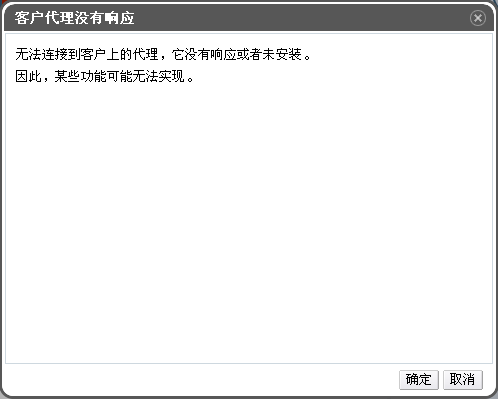

# 连接至一台已经启动的虚拟机

虚拟机启动后，您就可以像操作一台物理机一样来操作虚拟机了，您可以对它进行连接并登录至虚拟机中。已经启动了的虚拟机的图标中都会显示“机器已准备就绪”的字样。

**连接至一台已启动的虚拟机**

1. 双击您选定的虚拟机来进行连接。

    
   **连接至虚拟机**  

2. 一台虚拟机的控制台窗口会显示出来。您现在就可以像使用物理机一样来使用这台虚拟机了。

> **注意1**
>
> 当您第一次使用 SPICE 进行连接时，您将被提示安装相应的 SPICE 组件或插件。如果您是第一次使用运行 Linux 的虚拟机进行连接时，您需要在 Mozilla Firefox 中安装 SPICE 插件，即 spice-xpi；如果您使用运行 Windows 的虚拟机进行连接，您需要安装 ActiveX 插件。

> **注意2**
>
> 如果您的虚拟机中尚没有安装 ovirt-guest-agent 这个包，那么您在以普通用户的身份登录到的用户门户中打开一台虚拟机的控制台的时候，EayunOS 管理端会弹出一个提示框，见下图：
> 
> 如果您确定您不需要安装 ovirt-guest-agent 这个包的话，你可以点击**确定**，控制台会正常的显示出来。但是正如提示框中所说：**某些功能可能无法实现**。例如，在您第一次登录某个虚拟机的时候，系统会让您输入您虚拟机的用户名和密码，然而如果您暂时不需要使用该虚拟机又不想关闭它，当然，您这时候只需要关闭虚拟机的控制台既可。然后某一时刻您又想使用这台虚拟机了，当您打开控制台的时候，您会发现操作系统不需要您来输入用户名密码，也照样进入了操作系统。对于一个普通用户来说，这时非常危险的。所以管理员应该为每台虚拟机安装 guest-agent 这个软件包。

