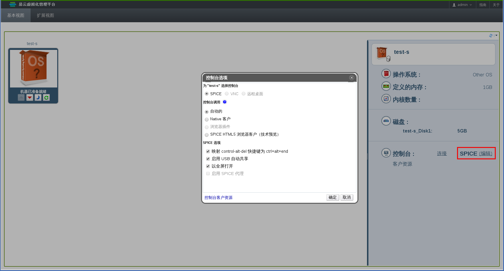
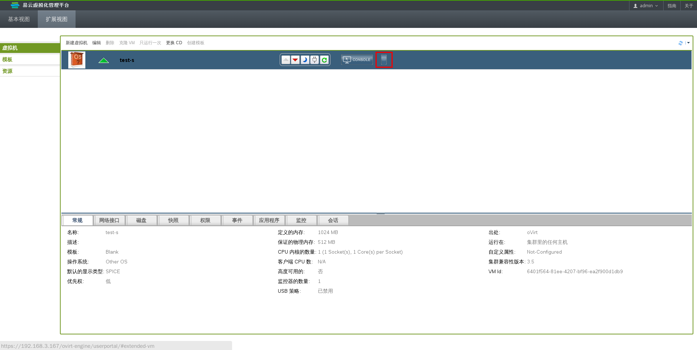

# 手动关联 console.vv 文件和 Remote Viewer

当您尝试使用**本地客户端**这个控制台选项打开一个连接到虚拟机的控制台时，您可能会被提示下载 **console.vv** 文件，如果您已经安装了 Remote Viewer 了的话，您就可以手动把 **console.vv** 文件和 Remote Viewer 相关联。这样，Remote Viewer 就可以自动使用这些文件来打开控制台。

**手动关联 console.vv 文件和 Remote Viewer**

1. 启动虚拟机。

2. A. 在用户门户的**基本视图**标签页中选择虚拟机。点**控制台**中的**编辑**链接打开控制台选项窗口。(注意：您必须开启虚拟机，才能点击**编辑**链接哦。)
   
   **在“基本视图”标签页中打开控制台选项**

   B. 在用户门户的**扩展视图**标签页中选择虚拟机。点**编辑控制台**按钮打开**控制台选项**窗口。
   
   **在“扩展视图”标签页中打开控制台选项**

2. 把控制台调用的方法改为 **Native 客户端**后点**确定**。

3. 打开到虚拟机的一个控制台，当提示打开或保存 **console.vv** 文件时，点保存。

4. 使用 Windows Explorer 在您本地的机器上找到保存文件的位置。

5. 双击 **console.vv** 文件。然后在提示时选择 **Select a program from a list of installed programs。**

7. 在 Open with 窗口中选择 Always use the selected program to open this kind of file，并点 Browse 按钮。

8. 找到 C:\Users\[user name]\AppData\Local\virt-viewer\bin 目录并选择 remoteviewer.exe。

9. 点 **Open**，然后点 **OK**。

**结果** 
您手工把 **console.vv** 文件和 Remote Viewer 相关联。当您使用“native 客户端”控制台调用选项打开一个虚拟机的控制台时，Remote Viewer 会自动使用 EayunOS 管理端提供的 **console.vv** 文件来打开虚拟机的控制台，而不会再要求您选择需要使用的应用程序。
