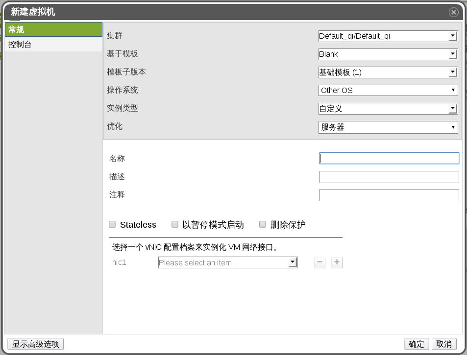

# 创建一台虚拟机

**介绍** 
您可以通过使用一个空模板来创建一台虚拟机，并对所有的属性进行配置。

**创建一台虚拟机**

1. 点击**虚拟机**标签页。

2. 点击**新建虚拟机**打开**新建虚拟机**窗口。

   
   **新虚拟机窗口**

3. 在**常规**标签页中，输入**名称**和**操作系统**的值。您可以使用其它项的默认值，也可以根据您的需求来修改它们。

4. 或者，您还可以依次点击**初始运行**、**控制台**、**高可用性**、**资源分配、**引导选项**、**随机数生成器**标签页来为您的虚拟机进行进一步的配置。

5. 点击**确定**创建虚拟机，新建虚拟机的窗口随机关闭。

**结果** 
新的虚拟机被创建，并显示在虚拟机列表中，不过它的状态是**关机**状态。在您使用这个虚拟机之前，您需要至少添加一个网络接口和一块虚拟磁盘，并安装一个操作系统。
