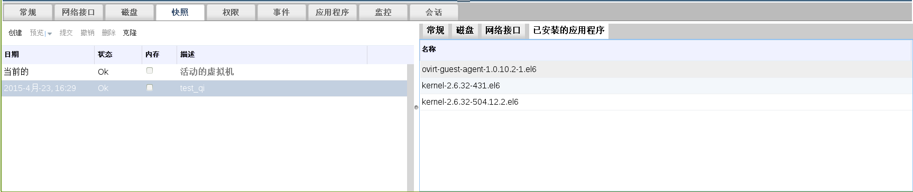

# 删除快照

**概述** 
删除一个虚拟机快照，并把它从 Red Hat Enterprise Virtualization 环境中永久删除。

> **注意**
>
> 您可以从一个正在运行的虚拟机上删除快照，这将不会影响到虚拟机的状态。

> **重要**
>
> 当删除一个快照时，一个和快照大小相同的新逻辑卷会被创建。被删除的快照会和它后面的快照进行合并，并保存在新创建的逻辑卷中，这个逻辑卷的大小会被扩充来保存快照合并的结果。如果被删除的快照和它后面的快照没有重叠的内容，这个新建逻辑卷的大小将和被合并的两个快照的大小相同。因此，在开始删除一个快照前，您需要确保您的系统中最少有被删除的快照大小和它后面的快照大小总和相同的可用存储空间。

**删除一个快照**

1. 选**虚拟机**标签页并选择一个虚拟机。

2. 在详情框中点**快照**页来列出有效的快照。
   
   **快照列表**   

3. 选择要被删除的快照

4. 点**删除**打开**删除快照**确认窗口。

5. 点**确定**。

**结果**
您从虚拟机上删除了一个快照，这个快照将不再有效。
