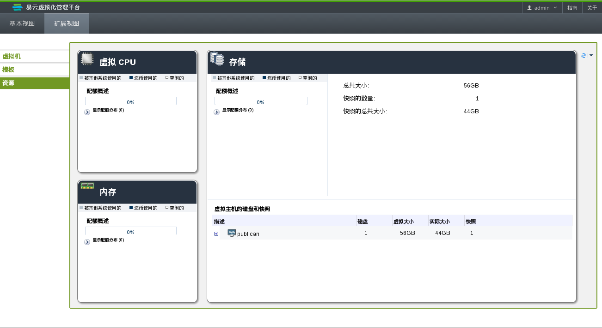

# 监控资源

当您需要通过用户门户对虚拟机进行配置改变前，我们推荐您对可用资源进行一个检查。这可以确保有足够的资源来满足系统高峰期的性能，并可以避免在主机上运行过量的虚拟机。 

导航框中的**资源**标签页显示了用户门户中的所有资源的信息，以及每个虚拟机的性能和相关的统计数据。

 
**资源标签页**

* **虚拟 CPU**：这个区域中显示了您系统上被使用的虚拟 CPU 的数量，以及被您或其它用户所占用的 CPU 配额。

* **内存**：这个区域显示了被您或其它用户所占用的内存配额，以及可用的内存配额数量。

* **存储**：这个区域显示了您或其它用户所占用的存储配额、您的所有虚拟磁盘的总容量、您的虚拟机的快照数量以及快照的总大小。另外，它还显示了每个虚拟机上的磁盘的信息。点虚拟机旁的 + 按钮可以显示附加到这个虚拟机上的所有虚拟磁盘。 

