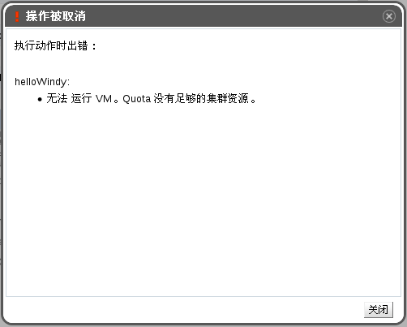

# 超出配额时需要做什么

Red Hat Enterprise Virtualization 提供了一个限制资源使用的功能 - 配额（quota），它可以被用来限制每个用户可以使用的 CPU 和存储资源。配额会比较新建虚拟机所需消耗的虚拟资源，和系统管理员所设置的、允许您使用的存储资源和运行时资源。 

当您所使用的资源超过了配额限制时，会出现一个窗口提示您已经超过了您的配额，您将无法访问虚拟资源。例如，当您的系统中同时运行了太多的虚拟机时，超过配额的情况就可能发生。

 
**超出配额的错误信息**

如果需要继续使用您的虚拟机，您可以：
* 关闭您不再需要使用的虚拟机。这可能会使您所使用的资源降到配额所允许的范围内，这样，您就可以正常使用其它虚拟机了。
* 如果您没有权利关闭虚拟机，您可以联系您的系统管理员。系统管理员可以为您增加配额或删除不再需要的虚拟机。
