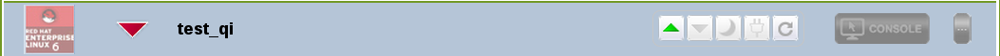
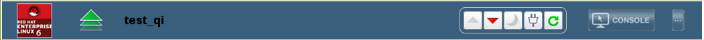
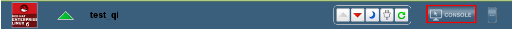

# 连接至虚拟机

在您登录到门户界面后，您就可以启动、停止或连接所显示的虚拟机。

**概述** 
以下介绍了如何启动一个已经停止的虚拟机，以及如何连接至虚拟机。

**连接至虚拟机**

1. 
   **关闭的虚拟机**
   
   选择您需要连接的虚拟机，点点击 按钮。虚拟机会被启动，虚拟机名称旁的停止图标会变为启动图标。
   当虚拟机启动完成后，虚拟机名旁的图标变为运行图标。   

   
   **虚拟机被启动**

2. 点击**控制台**按钮连接至虚拟机。

   
   **连接至虚拟机**

3. 如果您是第一次使用 SPICE 进行连接，您将被提示安装相应的 SPICE 组件或插件（plug-in）。如果您是使用运行 Linux 操作系统的机器进行连接时，您需要在 Mozilla Firefox 中安装 SPICE 插件（SPICE plug-in）；如果您使用运行 Windows 操作系统的机器进行连接，您需要安装 ActiveX 组件。

一个虚拟机控制台的窗口会被显示。您现在就可以像使用物理机一样使用这台虚拟机了。

**结果** 
您启动了一台已经被停止的虚拟机，并与它进行连接。

> **注意**
> 在默认的情况下，运行 Windows 7 的虚拟机会在连续 1 个小时没有操作的情况下进入挂起状态，这样用户将无法通过用户门户连接到虚拟机。要避免这个问题的发生，在虚拟机的电源管理器中禁用“省电（power-saving）”的功能。

