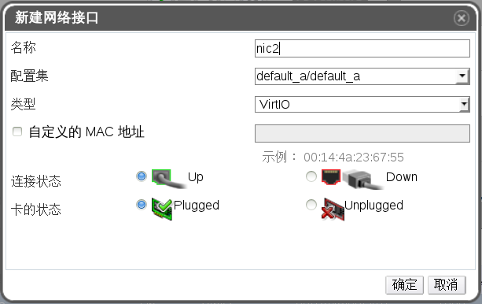
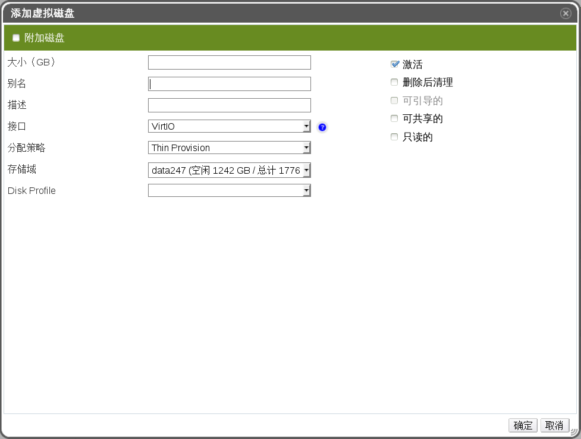

# 配置虚拟机的网络接口和硬盘

**概述** 
在可以使用新创建的虚拟机前，**引导操作**窗口会提示您为虚拟机配置最少一个网络接口和一个虚拟磁盘。

**配置虚拟机的网络接口和硬盘**
1. 在**新建虚拟机 - 引导操作**窗口中，点**配置网络接口**打开**新建网络接口**窗口。您可以使用默认的值，或对它们进行修改。

    
   **新建网络接口窗口**
   输入网络接口的**名称**。

2. 使用下拉菜单为虚拟机选择网络接口的**网络**和**类型**。当网卡在虚拟机上被定义并连接到网络后，它的**连接状态**被默认设置为 **Up**。
   > **注意**
   > **网络**和**类型**项的值会根据集群可用的网络，以及虚拟机可用的网卡产生。

3. 如果需要，选择**自定义**的 **MAC 地址**，并输入网卡的 MAC 地址。

4. 如果需要，点**高级参数**旁的箭头来配置**端口镜像**和**卡的状态**。

5. 点**确定**关闭**新建网络接口**窗口，并打开**新建虚拟机 - 引导操作**窗口。

6. 点**配置虚拟磁盘**打开**新虚拟磁盘**窗口。

7. 为虚拟机添加一个**内部**的虚拟磁盘或一个**外部**的 LUN。

   
   **新虚拟磁盘窗口**

8. 点**确定**关闭**新虚拟磁盘**窗口。**新建虚拟机** - **引导操作**窗口会被打开。这里并没有其它必须配置的选项。
   
9. 点**以后再配置**关闭窗口。

**结果** 
您为虚拟机添加了一个网络接口和一个虚拟磁盘。
