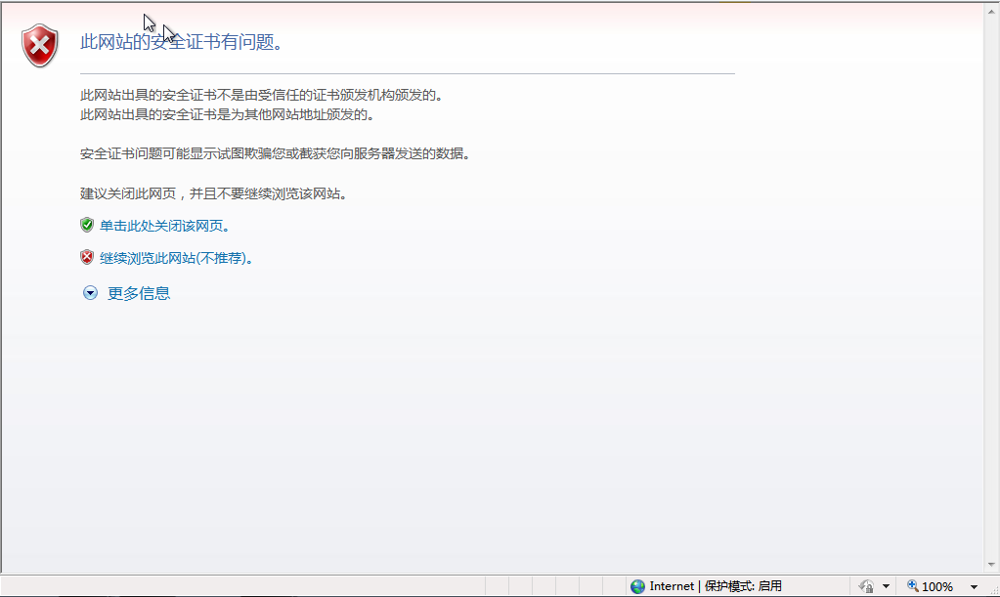
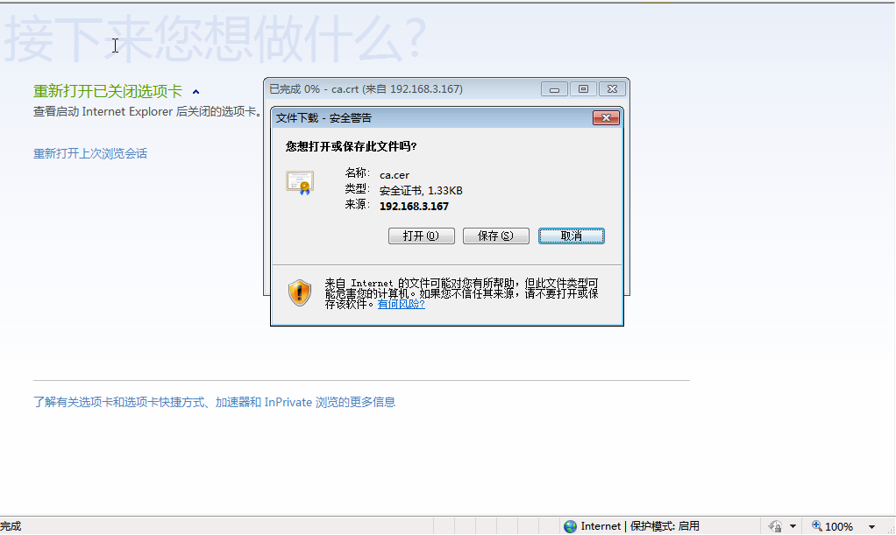
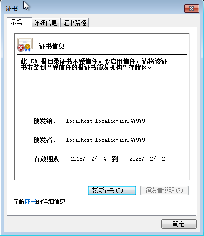
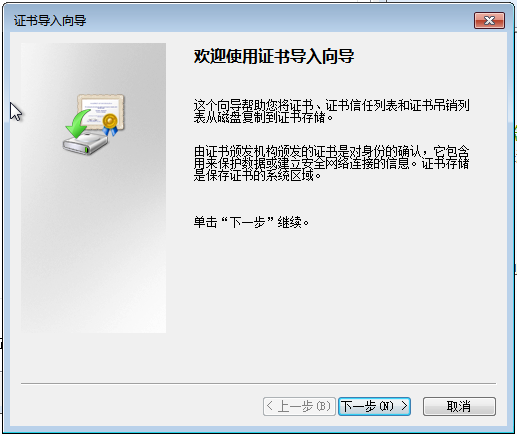
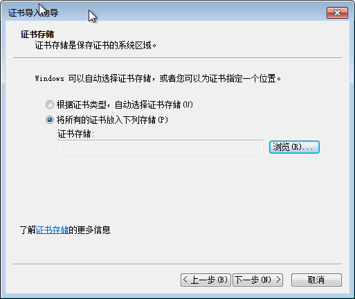
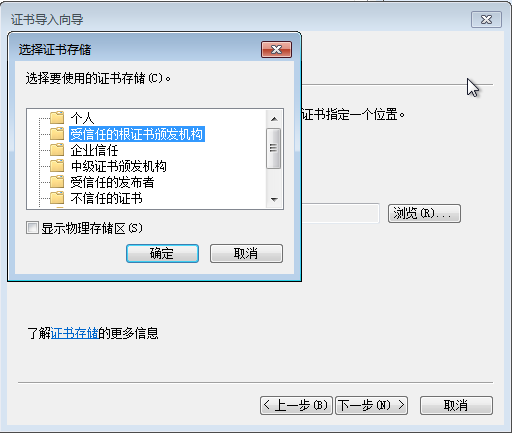
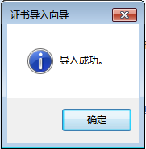

# 在 IE 浏览器中安装 EayunOS 管理端证书

**概述**<br/>
在您第一次登录到用户门户时,您需要安装 EayunOS 管理端所使用的证书来避免安全警告信息的出现。
<br/>
**初次在 IE 上访问用户门户**

**在 IE 浏览器中安装 EayunOS 管理端证书**

1. 使用以下的 URL：
   ```
   https://[your manager's address]/ca.crt
   ```
   <br/>
   **下载安装证书**

2. 在**文件下载 - 安全警告**窗口中点击**打开**按钮，弹出**证书**窗口。
   <br/>
   **证书**

3. 点**安装证书**按钮打开**证书导入向导**窗口。
   <br/>
   **证书导入向导**
   
4. 点击**下一步**，选择**将所有的证书放入下列存储**， 并点击**浏览**打开**选择证书存储**窗口。
   <br/>
   **证书存储**

5. 选择**受信任的根证书颁发机构**并点**确定**。
   <br/>
   **选择证书存储**
 
6. 点**下一步**进入**正在完成证书导入向导**界面。
   <br/>
   **完成证书导入**

8. 点**完成**安装证书。

   <br/>
   **导入成功**

**结果**<br/>
您安装了 Red Hat Enterprise Virtualization Manager 使用的证书。在您下次登录到用户门户时,安全警告
信息将不会再被显示。

