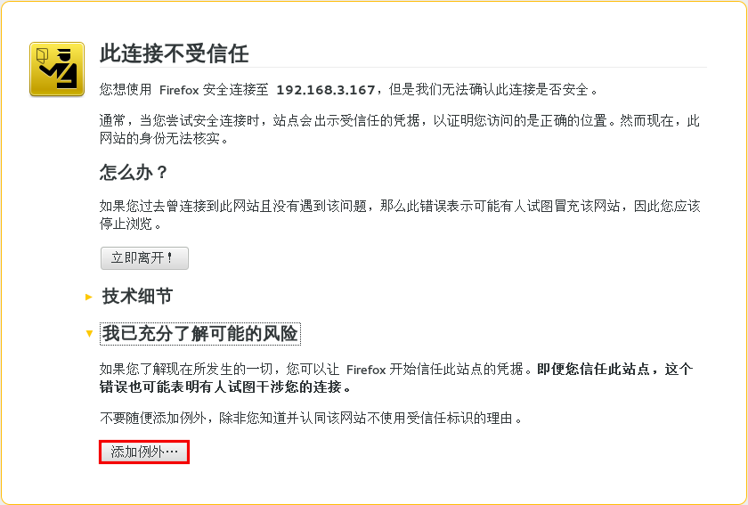

# 在火狐浏览器中安装 EayunOS 管理端证书

**概述** 
在您第一次登录到用户门户时,您需要安装 EayunOS 管理端所使用的证书来避免安全警告信息的出现。

**火狐浏览器中安装 EayunOS 管理端证书**
1. 在火狐浏览器中使用 URL 访问用户门户，会出现如下情形：
   

2. 点**添加例外**打开**添加安全例外**窗口。
   

3. 选中**永久保存此例外**选择框。

4. 点**确认安全例外**按钮。

**结果** 
您安装了 EayunOS 管理端使用的证书。在您下次登录到用户门户时,安全警告信息将不会再被显示。

