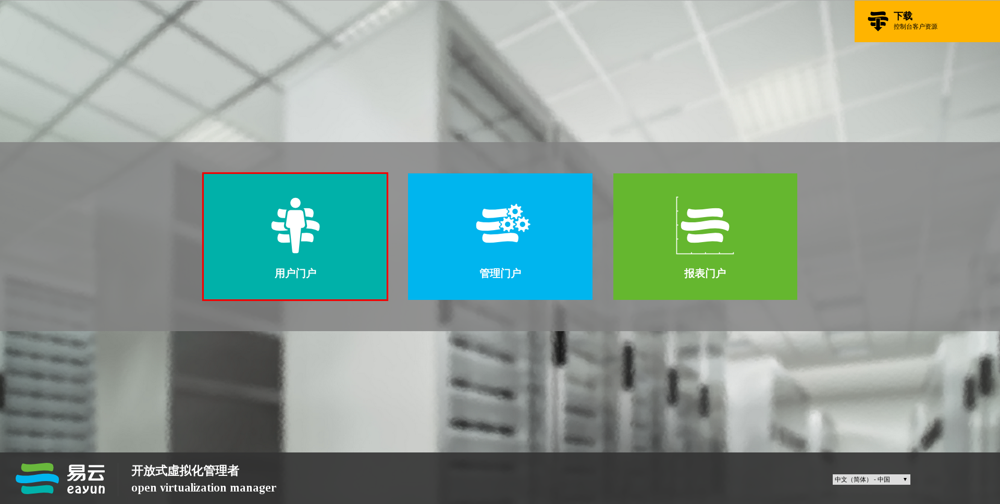
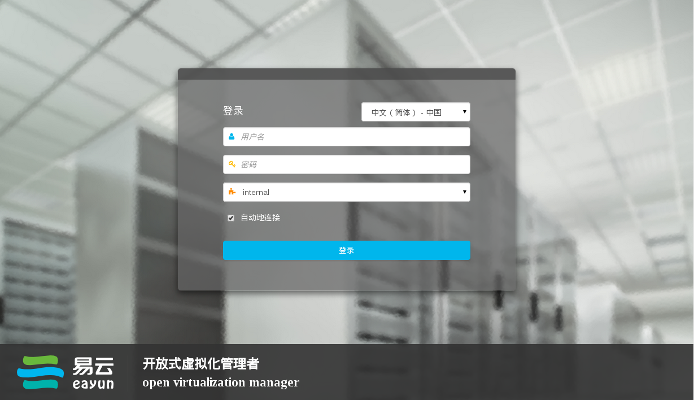
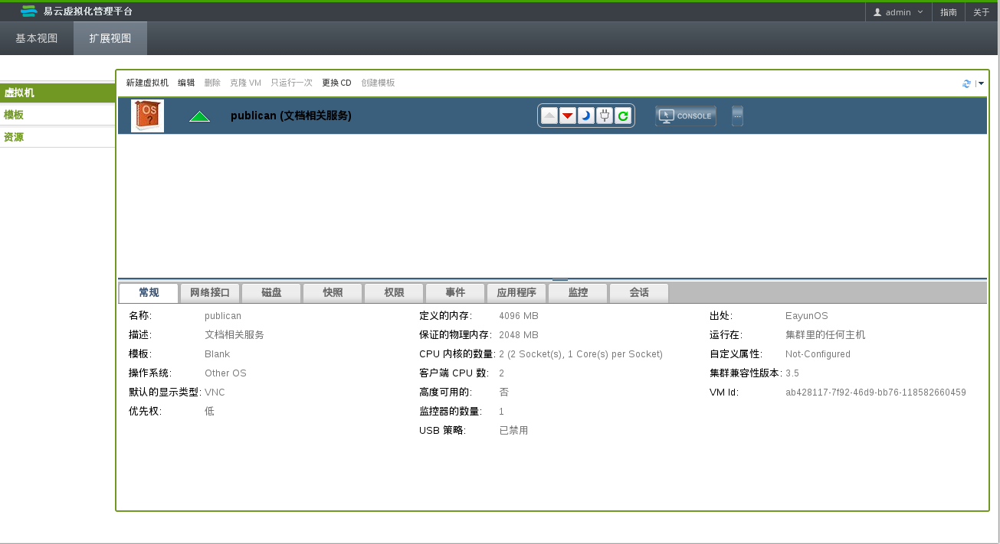

# 登录用户门户

用您的浏览器直接登录到 EayunOS 企业级虚拟化的用户门户。

**登录到用户门户**
1. 在您的网络浏览器的地址条中输入用户门户 URL，它的格式是 **https://server.example.com/ovirt-engine/userportal**。登录窗口会显示。 

   或者，在您的网络浏览器的地址条中输入**服务器地址**来访问系统的欢迎页面。点**用户门户**图片访问用户门户。
   
   **欢迎界面**

2. 输入您的**用户名**和**密码**。使用下拉菜单选择正确的域。
   
   **用户门户登录界面**

   * 如果您仅有一台正在运行的虚拟机，可以选择**自动地连接选项来**自动连接**到您的虚拟机。
   * 如果您有多台正在运行的虚拟机，或不希望**自动连接**到虚拟机，请不要选择自动地连接选项。
   * 在登录界面右下部的下拉菜单中选择用户门户所使用的语言。

3. 点**登录**。分配给您的虚拟机会被显示。
   
   **用户门户**

  
