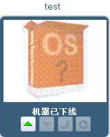
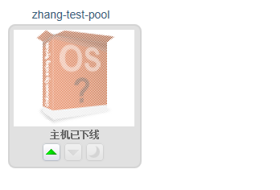
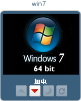
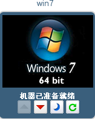

# 启动虚拟机

在用户门户使用一个虚拟机，您必须要启动它然后连接它。如果一个虚拟机是关闭的，显示灰色的并且显示“Machine
is Down”。

可以分配给您一个独立的虚拟机或是虚拟机池里的虚拟机。在同一个池里的虚拟机有着相同的操作系统和安装的应用。

如果您使用一个独立的虚拟机，选择这个虚拟机点击运行按钮去启动它。如图：

使用一个池里的虚拟机，选择池的图标点击运行按钮。如图：

虚拟机池分配一个接电（Power up）的虚拟机给您

虚拟机加电（Power up）。如图：

当虚拟机接电后，图标不再是灰色，文本显示“虚拟机准备就绪”，您现在可以连接虚拟机。如图：

> **Note**
>
> 您只能在虚拟机通电后连接虚拟机。

