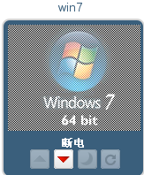

# 注销虚拟机

为了最小化数据丢失的风险，建议您在关闭虚拟机之前先注销虚拟机。如果您要强制关闭虚拟机，虚拟机状态被强制为“断电”。为了优雅的关闭虚拟机，使用以下步骤：

一旦您使用完虚拟机，根据特定操作系统的指示退出虚拟机。

1.  退出Windows系统的虚拟机，点击“Start”-\>“Log off”。

2.  退出Linux系统的虚拟机，点击“System”-\>“Log out”。

如果您正在使用一个全屏模式的虚拟机，按“Shift+F11”退出全屏模式，然后关闭虚拟机的控制台窗口。您现在返回到用户门户。

关闭虚拟机点击关闭按钮。虚拟机显示“断电”。如图：

虚拟机关闭后虚拟机呈现灰色并显示“虚拟机关闭”（“Machine is Down”）。

当您使用完用户门户，您可以退出用户门户按照用户门户退出的说明。

