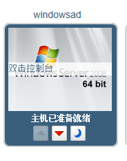

# 访问启动的虚拟机

虚拟机启动后，您能连接登录该虚拟机，同时可以像使用物理机一样使用它。虚拟机通电后显示“虚拟机准备就绪”。

双击待连接的虚拟机。如图：

显示虚拟机的控制台窗口。您现在像使用一个物理机一样使用该虚拟机。

> **Note**
>
> 如果是第一次使用SPICE连接虚拟机，将会提示您安装适当的SPICE组件或插件。如果是第一次连接一个Linux虚拟机，需要为Firefox浏览器安装SPICE插件。如果您连接一个Windows虚拟机则需要安装ActiveX插件。

