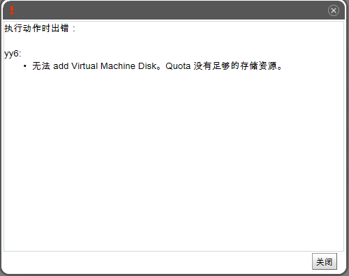

# 超过配额限制时如何解决

EayunOS虚拟化提供一个资源限制工具quota，该工具允许系统管理员去限制CPU数量和每个用户能消耗的存储空间。quota工具会在您使用虚拟机时消耗的虚拟资源量和系统管理员设定的存储量及运行时间限制之间进行比较。

当实际使用超过了您的之前设定的配额，会弹出窗口通知您已经超过配额，并且您将不能再获得虚拟机资源。例如这种情况会在您的环境下同时运行多个虚拟机时发生。如图:

重新恢复您的虚拟机，请执行以下操作之一：

1.  关闭你已不需要使用的虚拟机。这个将会降低您的资源消耗到不会超过配额限制的水平，现在您能够再次运行虚拟机。

2.  如果您不关闭一些正在运行的虚拟机，联系您的系统管理员去扩展您的配额限制或者删除一些没有用的虚拟机。

