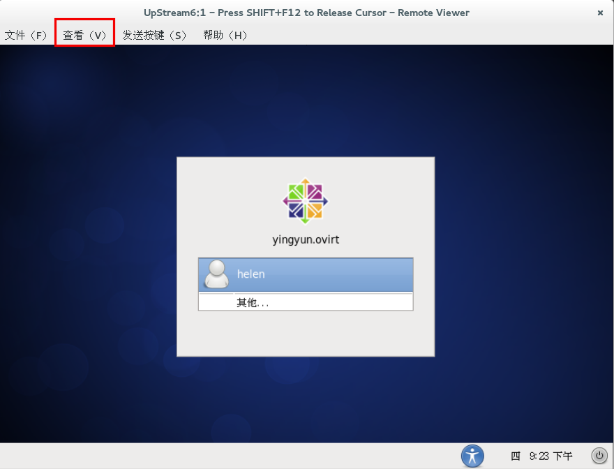

# 为操作系统是 linux 的虚拟机配置多个显示器

当您使用 SPICE 协议连接到虚拟机时，如果该虚拟机的操作系统是 Linux，那么您最多可以配置 4 个显示器。

1. 启动一个到虚拟机的 SPICE 会话连接。

2. 点击 SPICE 客户端窗口上部**查看**下拉菜单，如下图。
   

3. 点击**画面**，显示出下一级菜单。

4. 点击显示的名称来启用或禁用该显示。

> **注意**
>
> 在默认的情况下，当启动一个虚拟机的 SPICE 会话连接时，**显示 1** 是唯一的启用显示。在没有启用其它显示的情况下，如果您通过点击**画面**菜单下的**显示 1**来禁用该显示，那么该会话连接会立即结束。
