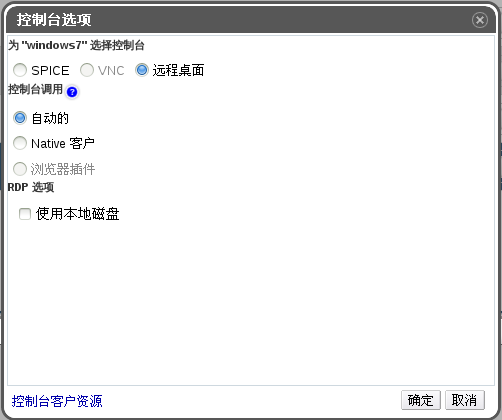

# RDP 控制台选项

当 RDP 连接协议被选择时，以下选项在控制台选项窗口中有效。
 
**控制台选项窗口**

**控制台调用**
* **自动的**：EayunOS 管理端会自动选择调用控制台的方法。
* **Native 客户**：当您连接到虚拟机控制台的时候，一个文件下载对话框提供了一个文件，通过 Remote Desktop 该文件可以打开虚拟机的控制台。

**RDP 选项** 
**使用本地磁盘**：选择该复选框后，客户端机器上的磁盘就可以被虚拟机所访问。
