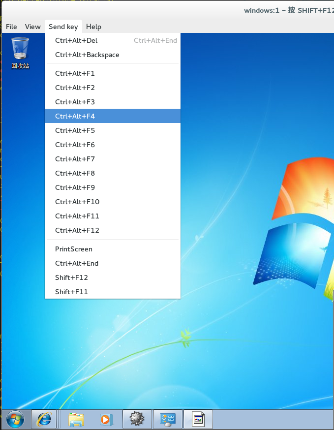

# Remote Viewer 选项

当指定了 Native 客户或浏览器插件控制台调用选项后，您将使用 Remote Viewer 和虚拟机进行连接。Remote Viewer 窗口提供了一组菜单来和所连接的虚拟机进行交互。

 
**Remote Viewer 连接菜单**

**Remote Viewer 选项**

| **选项** | **快捷键** |
| -------- | ---------- |
| File | <ul><li>**Screenshot**：对当前的屏幕进行截屏，并把它保存在您所指定的位置中。</li><li>**USB device selection**：如果 USB 重定义功能已经在您的虚拟机上被启用，插到您的客户端机器上的 USB 设备就可以从这个菜单中被访问。</li><li>**Quit**：关闭控制台。这个操作的快捷键是 **Shift+Ctrl+Q**。</li></ul> |
| View | <ul><li>**Full screen**：在全屏模式和非全屏模式间切换。在启用全屏模式时，虚拟机的显示会占据所有的屏幕显示。当启用非全屏模式时，虚拟机会在一个窗口中显示。使用或不使用全屏模式的快捷键是 SHIFT+F11。</li><li>**Zoom**：放大或缩小控制台窗口。Ctrl++ 会放大，Ctrl+- 会缩小，Ctrl+0 会把屏幕恢复到它原始的大小。</li><li>**Automatically resize**：选择这个选项可以使虚拟机显示的分辨率根据控制台窗口的大小自动进行调整。</li><li>**Displays**：允许用户启用或禁用虚拟机的显示。</li></ul> |
| Send key | <ul><li>**Ctrl+Alt+Del**：在 Linux 虚拟机上，它会显示一个包括了挂起、关闭或重启虚拟机操作的窗口。在 Windows 虚拟机上，它会显示 task manager 或 Windows Security 对话框。</li><li>**Ctrl+Alt+Backspace**：在 Linux 虚拟机上，它会重启 X sever。在 Windows 虚拟机上，它不起任何作用。</li><li>**Ctrl+Alt+F1**</li><li>**Ctrl+Alt+F2**</li><li>**Ctrl+Alt+F3**</li><li>**Ctrl+Alt+F4**</li><li>**Ctrl+Alt+F5**</li><li>**Ctrl+Alt+F6**</li><li>**Ctrl+Alt+F7**</li><li>**Ctrl+Alt+F8**</li><li>**Ctrl+Alt+F9**</li><li>**Ctrl+Alt+F10**</li><li>**Ctrl+Alt+F11**</li><li>**Ctrl+Alt+F12**</li><li>**Printscreen**：把 **Printscreen** 键盘选项传递给虚拟机。</li></ul> |
| Help | **About** 显示您所使用的 Virtual Machine Viewer 的版本信息。|
| 从虚拟机中释放鼠标 | **SHIFT+F12** |
