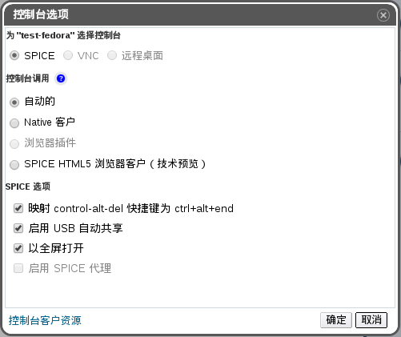

# SPICE 控制台选项

如果您选择了 SPICE 作为连接协议的话，以下的选项将会在控制台选项窗口中有效。

 
**控制台选项窗口**

**控制台调用**
* **自动的**：EayunOS Manager 会自动选择调用控制台的方法。
* **Native 客户**：当您连接虚拟机控制台的时候，一个文件下载对话框提供了一个文件，通过 Remote Viewer 该文件可以打开虚拟机的控制台。
* **浏览器插件**：当您连接到虚拟机的控制台的时候，您可以通过 Remote Viewer 直接连接到控制台。
* **SPICE HTML5 浏览器客户（技术预览）**：当您连接到虚拟机的控制台的时候，一个浏览器标签页会被打开，而它所呈现的就是虚拟机的控制台。

**SPICE 选项**
* **映射 control-alt-del 快捷键为 ctrl+alt+end**：选择这个选项可以把 **Ctrl+Alt+Del** 组合键映射为虚拟机上的 **Ctrl+Alt+End** 组合键。
* **启用 USB 自动共享**：选择这个复选框可以自动重定向 USB 设备到虚拟机。如果该选项没有被选择，USB 设备将会被连接到客户端的机器上，而不会连接到虚拟机。要想在虚拟机上使用 USB 设备，请您在 SPICE 客户端菜单中手动开启它。
* **以全屏打开**：选择该复选框后，当您连接至虚拟机时，虚拟机控制台会自动以全屏模式打开。点 SHIFT+F11 可以在全屏和非全屏模式间进行切换。
* **启用 SPICE 代理**：选择该复选框来启用 SPICE 代理。

> **重要**
>
> **浏览器插件**选项只在通过 IE 浏览器访问管理门户和用户门户时才有效。这个控制台选项使用 **SpiceX.cab** 安装程序所提供的 Remote Viewer 版本。对于其它类型的浏览器来说，**Native 客户**是默认的控制台选项。这个控制台选项使用的是 virt-viewer-x86.msi 和 virt-viewer-x64.msi 安装文件所提供的 Remote Viewer 版本。
