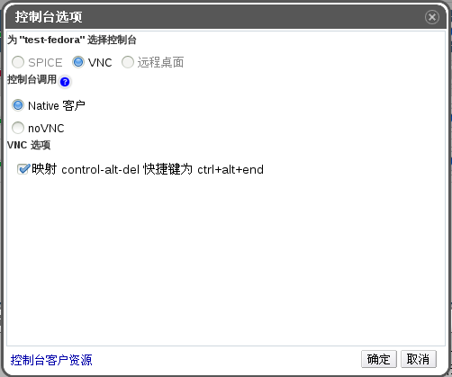

# VNC 控制台选项

如果您选择了 VNC 连接协议，可知以下选项在控制台选项窗口中才是有效的。

 
** 控制台选项窗口**

**控制台调用**
* **Native 客户**：当您连接到虚拟机控制台的时候，一个文件下载对话框提供了一个文件，通过 Remote Viewer 该文件可以打开虚拟机的控制台。
* **noVNC**：当您连接到虚拟机控制台的时候，一个新的浏览器标签页会被打开且呈现为当前虚拟机的控制台。

**VNC 选项**
* **映射 control-alt-delete 快捷键 ctrl+alt+end**：选择该复选框可以把 **Ctrl+Alt+Del** 组合键映射到虚拟机上的 **Ctrl+Alt+End** 组合键。
