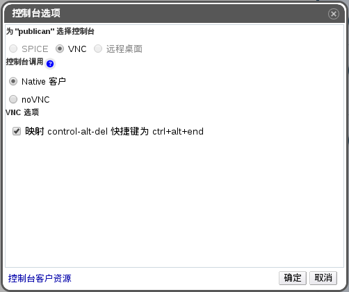

# 访问控制台选项

在用户门户中，您可以配置虚拟机的图形界面控制台的多个选项，例如调用控制台的方法或者允许/禁用 USB 重定向。

**访问控制台选项**

1. 选择一个正在运行的虚拟机。

2. 点击编辑控制台选项按钮，会弹出**控制台选项**窗口。

   

   **编辑控制台选项按钮**

> **注意**
>
> 其它一些针对于每个连接协议选项（如使用 VNC 连接协议时的键盘格式）可以在编辑虚拟机窗口中的控制台标签页中进行配置。
